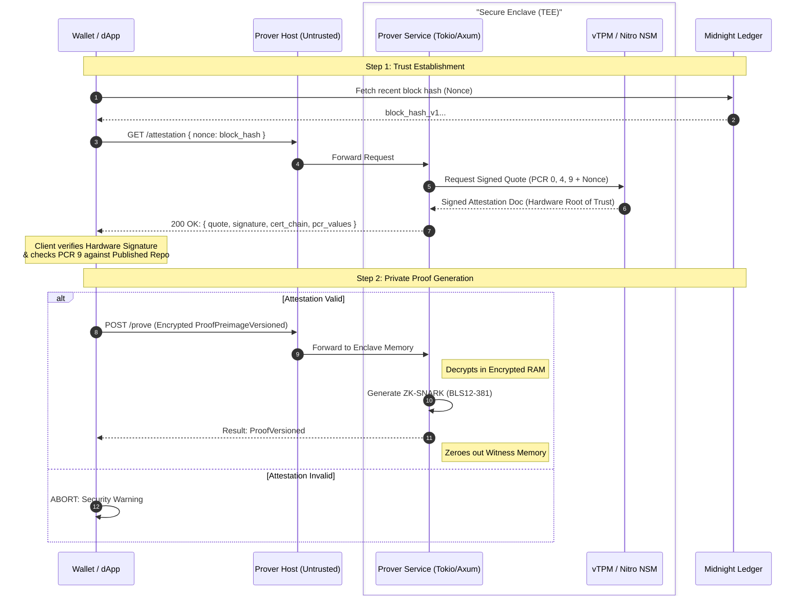

# **MIP-\#\#\#\#: Standard for Remote TEE-based Zero-Knowledge Proof Servers**

MIP: TBD

Title: Standard for Remote TEE-based Zero-Knowledge Proof Servers

Authors: Edward McGuire (ejm3iohk), Bob Blessing-Hartley (bobblessinghartley), Stefan Contiu (stefan-contiu) and Dimitar Jetchev (djetchev) 

Status: Proposed

Category: Standards

Created: 2026-02-20

Requires: None

Replaces: None

## **Abstract**

This proposal defines a standardized technical and security specification for Remote Trusted Execution Environment (TEE) based Zero-Knowledge (ZK) Proof Servers, enabling Midnight Network users to delegate computationally intensive ZK-SNARK proof generation to remote infrastructure without compromising transaction privacy. The standard mandates a hardware-rooted cryptographic attestation handshake—facilitating a verifiable link between the client wallet and the proof server—while specifying API structures, server-side isolation requirements, and the official measurement publication process necessary for "Verified Privacy".

## **Motivation**

Generating ZK-SNARK proofs for Midnight transactions is computationally expensive, often exceeding the capabilities of mobile or web-based wallets. While remote proof servers solve the performance bottleneck, they introduce a significant privacy risk: a malicious server operator or cloud provider could observe sensitive transaction data (amounts, recipients, balances).

By utilizing TEE technology (e.g., AMD SEV-SNP, AWS Nitro), this standard provides "Verified Privacy." It ensures that:

1. **Code Integrity**: Only the open-source, verified proof server code runs in the enclave.  
2. **Data Isolation**: Private transaction data is processed in encrypted memory inaccessible to the host operator.  
3. **Cryptographic Proof**: Users can verify the server's identity and security configuration before transmitting any data.

This MIP addresses the **Untrusted Cloud Operator** threat model by requiring servers to prove their code integrity and hardware security configuration before processing any sensitive transaction data. By providing for a standard, verifiably secure remote implementation, the ecosystem can scale performance without compromising user sovereignty.

## **Specification**

### **1\. TEE Platform Requirements**

Prover implementations must utilize hardware-isolated secure enclaves with support for remote attestation. Supported platforms include:

* **GCP Confidential VMs**: AMD SEV-SNP with Virtual TPM 2.0.  
* **AWS Nitro Enclaves**: Custom Nitro silicon utilizing `.eif` images.  
* **Azure Confidential VMs**: AMD SEV-SNP with Azure Attestation Service.

The following configurations are mandatory:

* **Hardware Isolation:** Instances MUST enable **Secure Boot**, **vTPM (v2.0)**, and **Integrity Monitoring**.  
* **Non-Debug Enforcement:** Production servers **MUST** be launched with debug mode **DISABLED** (e.g., `--debug-mode=false`). This is critical to ensure that hardware memory encryption is active and the CPU prevents any memory dumps or debugger attachment by the host OS.

### **2\. Mandatory Service Interface (Endpoints)**

The Proof Server **MUST** expose the following interface to clients, strictly utilizing **Tagged CBOR** for all cryptographic data::

| Endpoint | Method | Description |
| ----- | ----- | ----- |
| `/attestation` | GET | Must generate a fresh hardware quote from the vTPM/NSM, including a 32-byte nonce. |
| `/prove` | POST | Must process `ProofPreimageVersioned` payloads within a fixed worker pool. |
| `/check` | POST | Must perform circuit-level validation of preimages without executing full proof generation. |
| `/k` | POST | Must extract and return the security parameter ($k$) from provided ZKIR. |
| `/ready` | GET | Must report real-time health, active worker count, and queue depth. |

### **3\. Cryptographic Handshake (Verified Privacy)**

To satisfy the "Verified Privacy" requirement, the server and wallet engage in a hardware-rooted cryptographic handshake:

* **Attestation Request**: The server MUST return a **TPM quote** (v2) signed by the Hardware Manufacturer’s root of trust in response to a wallet-provided nonce.  
* **Measurement Reporting**: The response MUST be a JSON object containing the nonce, quote, signature, PCRs, the attestation identity key, and timestamp.  
* **Workload Identification**: The server MUST capture the measurement of the application workload (**PCR 9**, representing the Docker image hash) and include it in the report.

Verified Privacy Diagram: 

### **4\. Data Formats**

* **Serialization**: All cryptographic data must use **Tagged CBOR** (Concise Binary Object Representation) to ensure type safety and compact transmission.  
* **Proof Versioning**: Implementations must support `ProofPreimageVersioned` and `ProofVersioned` enums to allow for seamless protocol upgrades.

### **5\. Infrastructure & Network Security**

The following operator mandates apply to prevent data leakage at the infrastructure level:

* **TLS Termination**: SSL/TLS **MUST** terminate **inside the TEE enclave**, not at a load balancer.  
* **Minimal TCB**: The enclave image **MUST NOT** include an SSH server, shell access, or interactive utilities.  
* **Logging**: The container MUST output logs only as **structured JSON** to `stdout/stderr` for external collection.

## **Rationale**

The focus on Server-side mandates—specifically TLS termination inside the TEE and the use of TPM v2 tools—is necessary to address the untrusted host threat model. Standardizing the handshake and designated PCR 9 for the application hash provides a clear, standardized anchor for wallets to verify the specific version of the proof server with which they are interacting. 

Additionally:

* **Stateless Design**: The server is designed to be stateless to allow for horizontal scaling and high availability across cloud regions.  
* **Fixed Worker Pool**: A fixed-size thread pool (Tokio-based) prevents resource exhaustion during high-concurrency periods.  
* **On-Demand Parameter Fetching**: Large cryptographic parameters (up to 10GB for k=24) are cached locally to minimize proof generation latency while keeping the initial enclave image size manageable.

## **Backwards Compatibility Assessment**

This is a new standard for the Midnight ecosystem. It does not introduce breaking changes to the core ledger but establishes the expected interface for wallet-prover interactions. Future iterations must maintain support for `V1` proof formats while introducing new versions through the established `ProofVersioned` enum.

## **Security Considerations**

* **Debug Mode Enforcement**: Wallets **MUST** block all data transmission if the attestation report indicates `debug_mode = true`.  
* **Memory Encryption**: Hardware-level memory encryption (AES-128/256) must be active to prevent cold-boot and DMA attacks by the cloud provider.  
* **Side-Channel Mitigation**: While TEEs protect against direct memory access, operators should implement constant-time cryptographic operations to mitigate timing-based side-channel attacks.  
* **PCR Publication**: Security relies on the availability of trusted PCR hashes. These must be published via reproducible build pipelines to a secure, public registry.  
* **Statelessness**: The TEE MUST compute proofs without storing any persistent state.  
* **Host Vulnerabilities**: While TEEs provide strong isolation, the cloud host-OS and hypervisor are considered untrusted; trust is established solely through signed measurements and TEE hardware.

## **Implementation**

Reference implementations should utilize the **Axum** web framework and **Tokio** runtime in Rust for performance and safety.

* **Architecture**: Layered approach (API Layer → Worker Pool → Midnight Ledger Integration).  
* **TEE Detection**: Automatic platform detection (AWS vs. GCP vs. Azure) to ensure correct attestation document formatting.  
* **Performance Benchmark**: Servers MUST maintain a **p95 latency of \< 10 seconds** for $k=18$ proofs under a load of 16 concurrent requests.  
* **Reproducible Builds**: All code contributions MUST be verified via a reproducible build process before measurements are signed and published.

## **Testing**

* **Load Testing**: Must maintain stable p95 latency for $k=18$ proofs under a load of 16+ simultaneous requests.  
* **Attestation Validation**: Automated testing of certificate chain validation and PCR comparison logic.  
* **Replay Protection**: Testing to ensure that expired or re-used nonces result in a failed attestation handshake.

## **Copyright Waiver**

All contributions submitted in this MIP are licensed under the Apache License, Version 2.0. By submitting this MIP, the authors agree to the Midnight Foundation Contributor License Agreement.

