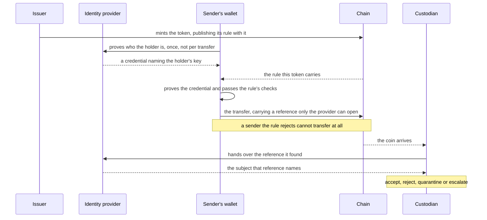
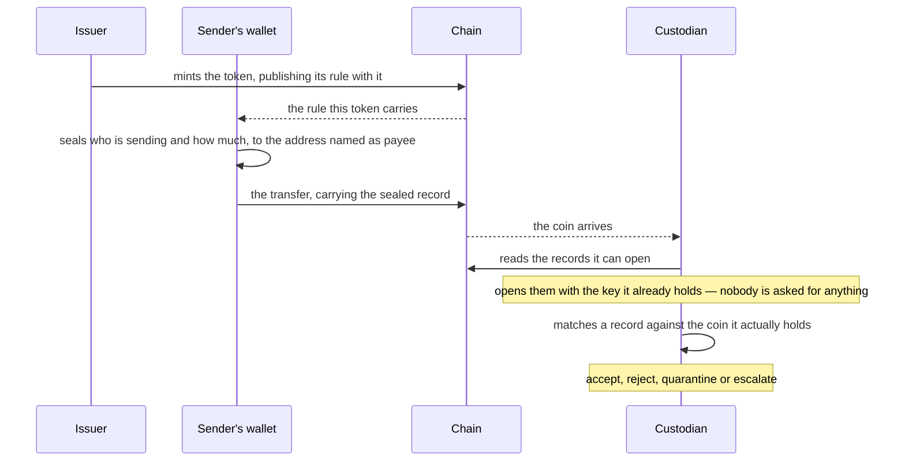
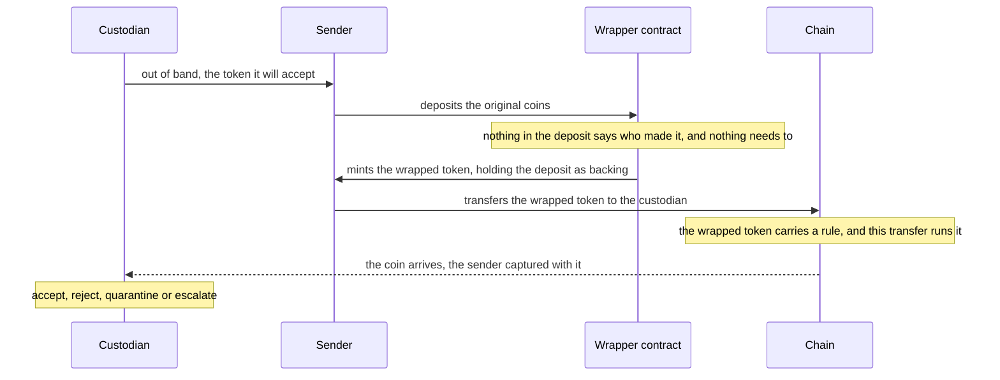

# Attribution designs

Three designs answering the question [MPS-0025](https://github.com/midnightntwrk/midnight-improvement-proposals/blob/main/mps/mps-0025-shielded-source-of-funds.md) asks: how a custodian — a regulated firm deciding whether to accept an incoming shielded asset — obtains source-of-funds evidence without making shielded transfers traceable. Design A checks who the sender is and refuses the transfer outright if the answer is unacceptable, so the token can never have been held by a party the rule excludes. Design B seals a record of every transfer to the party being paid. Design C re-issues an asset that carries no rule as one that does, so that the transfer into the custodian is gated. All three are spend rules under [the proposal](MIP.md), and all assume wallet-held coins: a contract-held coin has no holder to carry a credential, and attributing one falls to the issuer's registry.

## What they share

A spend rule is a condition on the coin moving. A sender who omits what the rule asks for has not made a non-compliant transfer; they have failed to transfer. So the coin does not move without a record, and a sender the rule rejects does not move it at all. Whether that record is one the custodian can read is the sender's choice, and the acceptance decision settles it: a custodian that cannot read a record, or reads one not matching the coin it holds, declines rather than complains later.

All three are sender-side mechanisms serving a receiver-side problem: MPS-0025 is about incoming assets, and the circuit that authorises a spend sees no outputs; what a gate — the code a rule runs — is handed is the payee the sender names, a claim about who is being paid. All three run the gate as a contract, so it holds state the issuer revises under published governance: the providers it trusts, the parties it will not let spend, the lists a compliance rule actually turns on. The price is named in the proposal — a holder relies on the gate's governance as well as its code — and it buys evidence that the rule was consulted at every hop since the mint.

The axis between them is where the evidence travels. Design A publishes a reference nobody can read and has the identity provider resolve it. Design B publishes the evidence itself, sealed, and the payee's own key reads it. Design C carries whichever of the two the wrapped token is given, and its point is reach rather than evidence: an asset whose issuer never adopted a rule can still arrive under one. MPS-0025's hard case is an asset from a party the custodian has never met, and none of the three has to ask that party for anything.

## Design A — checking who the sender is

Design A is the shape regulated tokens already use elsewhere: [ERC-3643](https://eips.ethereum.org/EIPS/eip-3643), the T-REX standard, where an identity registry and a set of compliance rules together decide whether a transfer may happen at all. The holder proves who they are to an identity provider once and receives a credential naming their key. The gate asks for proof of that credential on every spend, and for anything else the issuer's rules require — that the sender is not on a sanctions list, that the credential has not been revoked or expired. A sender who fails a check does not make a non-compliant transfer: the transfer does not happen. That is the design's strength, and it is about the token's whole history rather than the payment in front of you — the rule ran on every transfer since the mint, so there is no hop at which an excluded or unidentified party could have held the asset, and nothing for a custodian to discover after the fact. What it establishes is who held the token, not that their money was clean; the checks are only as good as the provider's registry and the lists the issuer keeps. ERC-3643's other half, gating who may receive, does not translate, which leaves the check on the party letting go of the coin.

Design A, end to end. The credential comes once from the provider, and the custodian resolves the sender without ever asking the sender.

**Making a transfer.** The wallet finds the rule and fetches the gate. The credential comes once from the provider rather than per transfer. To spend, the wallet proves it holds a valid one and that the gate's lists do not exclude it. A holder without a credential cannot produce the proof and so cannot spend: there is nothing to waive. Expiry and revocation are ordinary cases rather than gaps, because the gate is a contract and can consult a list the issuer keeps current.

**What reaches the chain.** One short reference per spend, blinded by a fresh value and tied to that spend, legible to nobody but the provider the rule names. The gate proves three things: the credential belongs to the party spending, a provider the rule names issued it, and the reference opens to that party and that spend. The circuit that authorises the spend ties those claims to the coin — its type is computed from this rule, and the party handed to the gate is the one whose secret authorises it. Nothing is asked of the sender afterwards, which is what lets this design reach a sender the custodian has never met.

**How the custodian learns.** The custodian holds the coin and computes its token type from the rule it reviewed. That alone says the gate ran at every hop, before any reference is opened — the asset arrives already carrying its compliance rather than waiting to be assessed for it. The transaction that created the coin lists the nullifiers of the coins spent to fund it — the one-time markers that prevent double-spending — and nothing says which funded this coin. The custodian finds the references those spends published and takes them to the provider, which resolves the one it issued into a subject someone answers for. What it keeps — the reference, the provider's answer, the credential's terms, the rule's source — a third party can re-check. The cost is that the provider sits in every decision and is trusted to answer honestly about its own subscribers.

## Design B — a sealed record of every transfer

Design B is a gate that seals a record of every spend to the party being paid. Nothing is asked for, nothing arranged in advance: the record is made by the act of spending, and the custodian opens it with the key behind the shielded address it already publishes so it can be paid at all.

Design B, end to end. No arrow returns to the sender: the custodian reads what was sealed to it and matches it against its coin.

**Making a transfer.** Nothing to obtain beforehand, nobody to ask. The wallet finds the rule, fetches the gate, and proves as for any guarded coin. The gate takes the coin, the party spending it and the payee it is handed, and seals the first two under the payee's key. The holder sees one extra proving step, no ceremony.

**What reaches the chain.** The sealed record, one per spend. The gate proves it a well-formed sealing, under the key it was handed, of the party spending and the coin's value it was handed, so a wallet cannot seal a convenient lie in their place. The circuit that authorises the spend fixes those two as the coin's own. The limit sits in the address: it is the sender's choice, so a record can be addressed to a party that was never paid, and matching it against a coin actually held is what tells the two apart. The toolkit those gates are written in has no sealing step, and nobody has costed one at gate sizes.

**How the custodian learns.** The custodian has no funding relation on the chain either: it reads the nullifiers of the coins spent into its coin's transaction and tests the candidates. It reads the records sealed to its own address and no others, then matches one against a coin it actually holds — and a record matching nothing tells it nothing, which is what makes a record sealed to a party that was never paid useless. A readable record says someone in that transaction claims the payment, not that the coin came from them; a second party can add one. A contract cannot be an audience at all, having no key to open anything. The custodian keeps the sealed record, the contents it opened and the rule's source, again re-checkable by a third party. One alternative the design does not take: a standing key registered at mint — an issuer's, or an analytics provider's — which can answer about any spend of that token for its whole life, and so is a third party in every acceptance decision.

## Design C — a wrapping contract

Design C is a contract that re-issues an asset as one carrying a spend rule. The sender deposits the original coins and receives a wrapped token in their place; the custodian accepts only that token. The capture is not in the wrapping — nothing in a deposit says who made it — but in the transfer afterwards: the wrapped token carries a rule, and the transfer that pays the custodian is the one that runs it and hands over the sender.

Design C, end to end. The deposit is anonymous and stays that way; the payment into the custodian is where the rule bites.

**Making a transfer.** The custodian's shielded address is exchanged out of band. A token type is derived from the contract that minted it, so it names its minter unforgeably, and a custodian accepting only that type has what it needs. What this buys over the other two is that the original asset never had to carry a rule: an issuer who never adopted one, or an asset minted long before the mechanism existed, can still reach a custodian that requires one. The price is the backing the wrapper holds, which splits fungibility and brings back counterparty risk, solvency and censorship.

**What it establishes, and at what price.** The rule on the wrapped token is one of the two above, so what the custodian learns is what that rule gives it, and the capture happens on every hop the wrapped token makes rather than once. What the wrapper cannot supply is history: the deposit proves nothing about who made it — a shielded payment on its own never does — so the asset's life before it was wrapped is cut off at the boundary. The wrapper must also be built so that what it holds does not give away what each depositor put in. Its own records can be kept closed; the exposure is the minting, which is public and carries the amount, so the size of each payment shows unless the design does something about it.

## Where they differ

Two things all three rest on, before the differences.

A gate is handed a key or a contract's address; neither is a person. Turning one into a subject takes a registry: someone who attests that this key belongs to that institution or individual, and answers when asked — Design A's identity provider; Design B names nobody; Design C inherits whichever of the two its wrapped token carries. The registry's terms are where the compliance judgement lives, and are specified nowhere here.

All three file what they retain under the nullifier, and a nullifier is only as good as what ties it to a sender — which the proposal leaves open: an absent record is not evidence, a present one not attribution.

Four of [MPS-0025](https://github.com/midnightntwrk/midnight-improvement-proposals/blob/main/mps/mps-0025-shielded-source-of-funds.md)'s requirements fall out of the mechanism rather than any one design: that a custodian can obtain evidence when it needs it; that shielded transfers do not all become publicly traceable; that regulated workflows need no bespoke agreement per transfer; and that permissionless transfers stay usable outside regulated contexts. [The companion](source-of-funds-by-construction.html)'s section 06 assesses them. Four discriminate.

| Requirement | Design A | Design B | Design C |
|---|---|---|---|
| The evidence supports a decision — accept, reject, quarantine, escalate | A named subject and the claims about it, resolved through the provider — and every earlier holder passed the same checks, so an excluded party never held it. | Sender and the coin's value on the record for every spend, what a risk model reads, opened without asking. | Whatever the wrapped token's own rule gives — but nothing about the asset's life before it was wrapped. |
| Sender, recipient, amount and transaction graph stay shielded by default | A constant-size blinded reference per spend, legible to nobody but the provider; the value stays hidden from every party. | Sender and the coin's value become readable to whoever holds the address the sender names, and nobody else; the key named is the wallet's, so what it sees reaches past this asset. | As the rule the wrapped token carries, except that each mint publishes its amount, so payment sizes show unless the design works around it. |
| Disclosure reaches only the parties and the context that require it | Per asset, at the moment it is asked for; the default is nothing, and only the provider can open a reference. | A disclosure reaches only the address the sender names, and only its holder can read it; a custodian acts on one that matches a coin it holds. | As narrow as the rule the wrapped token carries; the wrapper itself learns nothing about who deposited. |
| The custodian can retain audit evidence for the decision it made | The reference, the provider's answer and the rule's source, each re-checkable later. | Every transfer the custodian accepts leaves a record it can read, and a missing or mismatched one is visible before acceptance rather than after. | What that rule leaves behind, plus the wrapper's public mint record. |

## Where each breaks

**A fresh start at the wrapper.** Design C rules the wrapped token's hops and none of the ones before it. Coins of unknown history go in and a compliant-looking asset comes out, so what the custodian learns is who paid it, never where that money had been.

**What none of them reaches.** None lets a recipient refuse an incoming coin. A spend rule decides who may spend and never to whom — the payee a sender names is a claim about who is being paid — so declining to be paid is a separate construction, sketched in the proposal's *Future: guarding receipt as well as spending*. And all three end at a key rather than a name: the registry resolving one into the other is unspecified here, and the component most worth attacking.
