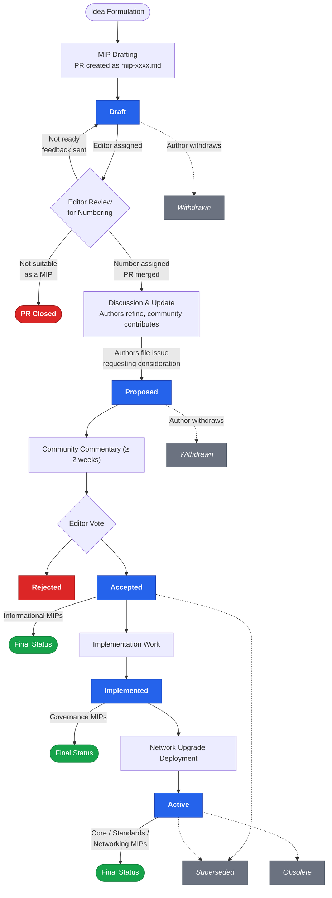

<!--
 Copyright 2025 Midnight Foundation

 Licensed under the Apache License, Version 2.0 (the "License");
 you may not use this file except in compliance with the License.
 You may obtain a copy of the License at

     https://www.apache.org/licenses/LICENSE-2.0

 Unless required by applicable law or agreed to in writing, software
 distributed under the License is distributed on an "AS IS" BASIS,
 WITHOUT WARRANTIES OR CONDITIONS OF ANY KIND, either express or implied.
 See the License for the specific language governing permissions and
 limitations under the License.
-->

## Abstract

A Midnight Improvement Proposal (MIP) is a formalised design document for the Midnight community, and also the name of the process by which such documents are produced and listed.
A MIP provides information or describes a change to the Midnight ecosystem, processes, or environment concisely and in sufficient technical detail.
In this MIP, we explain what a MIP is, how the MIP process functions, the role of the MIP Editors, and how users should go about proposing, discussing, and structuring a MIP.

The Midnight Foundation intends MIPs to be the primary mechanisms for proposing new features, collecting community input on an issue, and documenting design decisions that have gone into Midnight.
Plus, because MIPs are text files in a versioned repository, their revision history is the historical record of significant changes affecting Midnight.

## Motivation

MIPs aim to address two challenges mainly:

- The need for various parties to agree on a common design in order to create interoperable tools or interfaces.
- The need to propose and discuss changes to the Midnight protocol, ecosystem, or established practices.

The MIP process does not *by itself* offer any form of governance.
For example, it does not govern the process by which proposed changes to the Cardano protocol are implemented and deployed.
Yet, it is a crucial, community-driven component of the governance decision pipeline as it helps to collect thoughts and proposals in an organised fashion.
Additionally, specific projects may choose to actively engage with the MIP process for some or all changes to their project.

The process detailed herein is intentionally lightweight and is expected to evolve as the Midnight community grows.
This document outlines the technical structure of the MIP and the technical requirements of the submission and review process.

## Specification

### Versioning

The specification in this MIP will be versioned using semantic versioning (SemVer).
Any changes to the specification must be submitted as a new MIP if they affect backwards compatibility or introduce new requirements.

### Process Overview

The Midnight Improvement Proposal (MIP) process consists of the following stages:

1. **Idea formulation:** An idea for an improvement is conceived.
   Simple improvements (like performance improvements or better error messages) and bug fixes generally do not need a MIP.
   These can be submitted directly to the relevant Midnight issue tracker instead.
   Bigger improvements first start with an idea.
   This could be a feature request or arise out of other discussion.
   In any case, it's a good idea to vet the idea publicly in some way to gauge if it fits a genuine need and is likely to be acceptable.
   It's **very** important that proposed changes are well-motivated.
   Adding features and changing implementations has a cost, which must be justified by a corresponding benefit.

1. **MIP drafting:** A formal MIP document is created.
   This is a document that follows the template structure in `mip-template.md`.
   The authors must create a [midnightntwrk/midnight-improvement-proposals](https://github.com/midnightntwrk/midnight-improvement-proposals) PR where the MIP document is added to the `mips` subdirectory.
   The name of the document must be `mip-xxxx.md` (those are literal `x`'s).
   The status of the MIP must be **Draft** (in the document, that is not necessarily the PR status).
   If the proposal has accompanying resources (such as images), they should be added to a subdirectory of `mips` with the same basename as the MIP filename
   (so for draft MIPs before numbering, this directory is `mips/mip-xxxx`).
   To signal that the MIP is ready for editors to consider numbering it, assign a MIP Editor as a reviewer and mention them in a PR comment.
   (Be explicit so the editors don't accidentally consider numbering the MIP before the authors are ready.)

1. **Editor numbering of the draft:** The MIP Editors consider the draft MIP PR, and assign a number if it's acceptable (as a draft).
   Note that this is **not** the same as acceptance of the MIP itself.
   The MIP Editors will review the draft at one of their next regularly scheduled meetings.
   They will ensure that the document is correctly formatted, that it is clear and understandable, and that it is well motivated.
   The editors will be generally lenient at this stage with the understanding that problems can be addressed before the MIP is eventually proposed.
   If the editors deem the MIP is not yet ready for numbering, it will be sent back to the authors with specific feedback.
   The editors may also close the PR if the proposal is fundamentally not suitable as a MIP (e.g., it is a duplicate, out of scope, or does not warrant a formal proposal).
   If the editors approve numbering the MIP, they will assign it a number and update the document by pushing to the PR.
   The editors will update the filename, the number in the document, and add the MIP as a draft to the index.
   The editors will then merge the MIP.

1. **Discussion and update:** The MIP authors finish the draft and address feedback to get it in shape for proposal.
   Discussion should happen in some public forum, such as the Midnight Discord server.
   The relevant issue tracker can be used to raise and track issues with the MIP.
   Contributors can send pull requests to improve the draft MIP.

1. **Proposal:** When ready, the MIP authors formally propose it to the MIP Editors for consideration.
   The MIP authors do this by filing an issue in the MIPs repository, asking for the editors to consider the MIP for acceptance.
   The editors will set the status of the MIP to **Proposed** and mark it as proposed in the index.
   There should be no more substantive modifications to the document
   (small changes like spelling and punctuation fixes are OK).

1. **Review and discussion:** The community and MIP Editors review and discuss the MIP.
   The MIP Editors will announce a period of community commentary, which usually will last at least two weeks.
   They will announce by posting in the proposal issue that they will discuss the MIP at a specific regularly scheduled editors meeting after the commentary period has passed.

1. **Editor decision:** The MIP Editors decide to accept the MIP or not.
   The editors will vote to accept (status **Accepted**) or reject (status **Rejected**) the MIP.
   At this point the authors' job is done (as authors, they can still contribute to implementation).
   The editors will update the MIP document and the index to reflect the status.

1. **Implementation:** Accepted MIPs are implemented by development teams.
   The editors' acceptance represents a decision for the project to adopt the proposed improvement.
   For protocol changes or tooling improvements, this requires contributors to actually plan and perform the implementation work.
   For governance or process improvements, it requires the community to take steps to adopt the process.
   When implementation is completed the MIP's status is changed to **Implemented** by the editors
   (they might do this by approving a PR from the implementers to change the status).

1. **Deployment:** Implemented changes are deployed in a Midnight network upgrade.
   Implemented changes will not necessarily make it into the very next network upgrade.
   For example, a breaking protocol change might have to wait for a planned major version increment,
   or a change might require updates to multiple components across the Midnight ecosystem.
   When an implemented MIP is deployed, the status is changed to **Active** and the relevant network upgrade is noted.

### MIP Categories

MIPs are categorized to help organize and manage the different types of proposals:

- **Core:** Changes to the core Midnight protocol, consensus mechanisms, virtual machine, or other fundamental aspects.
  These may require a network upgrade.
- **Standards:** Proposals for standards and conventions related to application development, smart contract interfaces, data formats, etc., within the Midnight ecosystem.
- **Networking:** Improvements to network communication, peer discovery, and other networking-related aspects.
- **Governance:** Proposals related to the governance of the Midnight blockchain, including decision-making processes, roles, and responsibilities.
- **Informational:** Provides general information, guidelines, or research related to the Midnight Blockchain but does not propose a specific change.

### MIP Statuses

MIPs can have the following statuses mentioned in the Process Overview above:

- **Draft:** The MIP has been submitted as a PR to the MIPs repository and is undergoing writing and revision.
- **Proposed:** A draft MIP has been formally proposed to the MIP Editors for consideration.
  Writing and revision are done.
- **Accepted:** The MIP Editors have voted to accept a proposed MIP.
  For accepted informational MIPs, this is the final status.
- **Rejected:** The MIP Editors have voted to reject a proposed MIP.
- **Implemented:** The improvement described in the MIP has been implemented.
  For accepted governance MIPs, this is the final status.
- **Active:** The implemented improvement has been deployed in a Midnight network upgrade and is active.
  For accepted core, standards, and networking MIPs, this is the final status.

In addition, there are other statuses that represent events occurring outside the normal process described above:

- **Superseded:** A newer MIP replaces this MIP.
  The newer (accepted) MIP explicitly does this by including as part of the proposal that it supersedes the superseded MIP ("Supersedes MIP-1234", for instance).
- **Obsolete:** The MIP is no longer considered relevant.
  The MIP Editors will occasionally vote to label MIPs this way for clarity.
- **Withdrawn:** The author(s) have withdrawn the MIP.
  This can happen at any time before the MIP Editors vote to accept or reject the MIP.

#### Status Transition Gates

The following table describes the criteria that must be met to transition between statuses:

| From | To | Gate / Criteria |
|---|---|---|
| — | **Draft** | PR submitted to the MIPs repository; editor assigns a number and merges |
| **Draft** | **Proposed** | Authors file an issue requesting editor consideration; document is complete |
| **Proposed** | **Accepted** | Editor vote after community commentary period (≥ 2 weeks) |
| **Proposed** | **Rejected** | Editor vote after community commentary period |
| **Accepted** | **Implemented** | Implementation work completed and verified |
| **Implemented** | **Active** | Improvement deployed in a Midnight network upgrade |
| Any (pre-vote) | **Withdrawn** | Author(s) withdraw the MIP |
| Any (post-accept) | **Superseded** | A newer accepted MIP explicitly supersedes this one |
| **Active** | **Obsolete** | Editors vote to mark the MIP as no longer relevant |

#### Submission

When a draft MIP is "finished" to the authors' satisfaction, it should be proposed by filing an issue in the [Midnight Improvement Proposals](https://github.com/midnightntwrk/midnight-improvement-proposals) repository.
The issue should specify the MIP number and ask the MIP Editors to formally consider it for acceptance.
The MIP Editors will announce the commentary period and when they will vote on the proposal.
After proposing for editor consideration, the MIP should not be substantially altered.

Note: Pull requests should not include implementation code: any code bases should instead be provided as links to a code repository.

Note: Proposals addressing a specific MPS should also be listed in the corresponding MPS header, in 'Proposed Solutions', to keep track of ongoing work.

#### Review and Discussion

Once a MIP is proposed, it enters a period of public review and discussion.
Feedback is encouraged from all Midnight community members.
Discussion should take place on the GitHub issue or by attending a MIP Editors meeting.
Technical experts may be consulted for specific aspects of the proposal.

#### Implementation

Once a MIP is accepted, it becomes a candidate for implementation.
Engineering teams (Shielded Architects & Engineers, community developers) will implement the changes specified in the MIP.

### Artifacts and Tools

- **MIP Document:** The core artifact is the MIP document itself, written in Markdown and stored in the MIPs repository.
- **MIP Template:** A standardized Markdown template for creating MIPs (see below).
- **GitHub Repository:** The `mips` subdirectory (in the MIPs repository) on GitHub will be used to:
    - Store all MIP documents.
    - Track the status of each MIP.
    - Facilitate discussion through PRs and issues.
- **Discussion Forums:** The Midnight Governance Hub (future state) and Discord server should be used for broader discussions and early-stage idea sharing.
- **Meeting Notes:** Notes from any meetings related to MIP discussions should be publicly available in this GitHub repository or linked from it.

### MIP Editors

The MIP process relies on a group of *MIP Editors* to manage the process, ensure quality, and facilitate community discussion.

#### Role and Responsibilities

MIP Editors are responsible for:

- Ensuring that MIPs adhere to the MIP template and meet the minimum quality standards (e.g., clarity, completeness, technical soundness).
- Assigning MIP numbers.
- Tracking the progress of MIPs.
- Facilitating community discussion and helping to resolve technical disagreements.
- Voting to accept or reject a MIP.
- Maintaining the MIPs in the repository, including an index of them and their statuses.

### Selection and Qualifications

MIP Editors should be selected based on the following criteria:

- **Technical Expertise:** A strong understanding of blockchain technology and the Midnight Blockchain architecture.
- **Community Standing:** Respected and trusted members of the Midnight community.
- **Impartiality:** Ability to evaluate MIPs objectively and fairly.
- **Communication Skills:** Excellent written and verbal communication skills.
- **Availability:** Willingness to dedicate sufficient time to review and process MIPs.

### Nomination and Rotation of Editors

The initial set of MIP Editors will be appointed by the Midnight Foundation and Shielded.
Subsequently the below set of rules will apply to the addition and removal of MIP Editors.

To become a MIP Editor one must be:
- Nominated by anyone.
- All sitting MIP Editors must agree to their becoming a MIP Editor by public vote at a MIP Editors' meeting either by expressing support in person or in a written submission to the meeting.

The Midnight Foundation will revoke the administrator rights of a MIP Editor over the MIP repository (and they will cease to be a MIP Editor) if one of the following happens:
- The MIP Editor themselves asks to resign.
- The MIP Editor fails to attend X MIP Editor meetings in a row and a petition is sent to the Midnight Foundation.
- All other MIP Editors vote to remove that specific Editor.

## Path to Active

Every MIP must define the criteria it must meet to transition from "Accepted" to "Active".

### Acceptance Criteria

Define objective criteria such as:
- Adoption by core client implementations
- Implementation by community projects
- Community consensus in workshop sessions
- Endorsement by Midnight maintainers or validators

### Implementation Plan

Describe how the MIP will be executed.
This may include:
- Timeline for integration into Midnight core software
- Teams responsible for development
- Testing and audit milestones

### MIP Template

All MIP documents *must* follow this Markdown template and use YAML front matter:

MIP: <Number> # assigned by editors
Title: <Proposal Title>
Authors: <Name> (<github-username>)
Status: <Status> # All new MIPs will be assigned Draft
Category: <Core | Standards | Networking | Governance | Informational>
Created: YYYY-MM-DD
Requires: [List of other MIPS this MIP depends on]
Replaces: [List of a MIP that this one replaces]
License: Apache-2.0

## Abstract

A short (~200 word) description of the proposed improvement.

## Motivation

Why is this change needed?
What problem does it solve?
Clearly explain the use cases and the benefits for the Midnight ecosystem.

## Specification

Describe the proposed change in detail.
This section should be technically precise and unambiguous.
It should provide enough information to allow for implementation.

## Rationale

Explain the design decisions behind the proposed change.
Why was this particular approach chosen?
What alternatives were considered, and why were they rejected?

## Path to Active

What does it mean to get from Accepted to Active, and how this will be achieved.

### Acceptance Criteria

Explain what objective milestones need to be achieved in order for the MIP to achieve Active status.

### Implementation Plan

Describe how the MIP will be put into practice.

## Backwards Compatibility Assessment

Describe how the proposed change affects existing systems, applications, and users.
Will it require a hard fork?
Are there any compatibility issues?
How will they be addressed?

## Security Considerations

Analyze the potential security implications of the proposed change.
Are there any new attack vectors or vulnerabilities introduced?
How will they be mitigated?

## Implementation

Describe how the proposed change will be implemented.
Which parts/components of the Midnight need to be modified?
What are the dependencies, if any?

## Testing

Describe the testing procedures for the proposed change.
What tests will be performed to ensure that it works as expected and does not introduce any regressions?

## References (Optional)

Are there any external sources that are referenced in this document, or that add to the efficacy of this MIP?

## Acknowledgements

List the contributors that were not the Authors, this will include any workshop participants.

## Copyright Waiver

All contributions (code and text) submitted in this MIP must be licensed under the Apache License, Version 2.0.
Submission requires agreement to the Midnight Foundation Contributor License Agreement [Link to CLA], which includes the assignment of copyright for your contributions to the Foundation.
