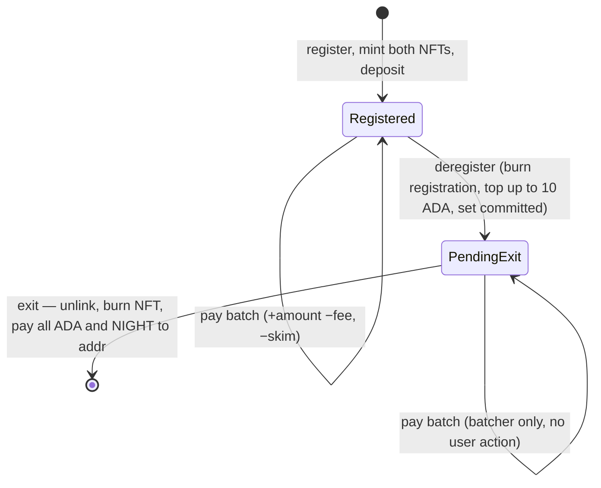
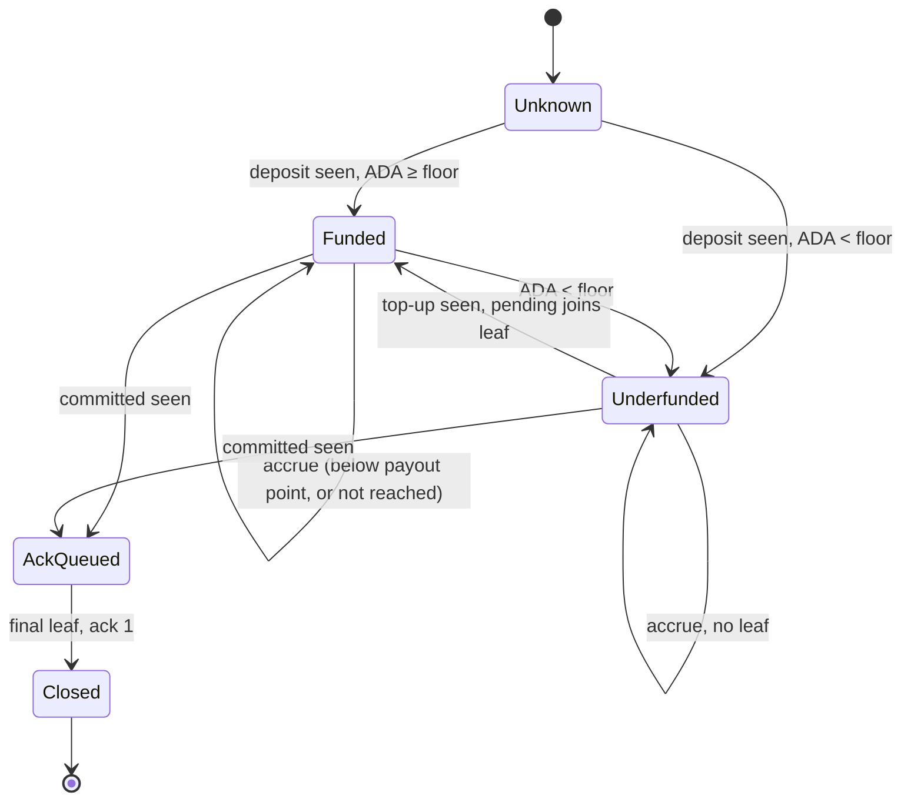
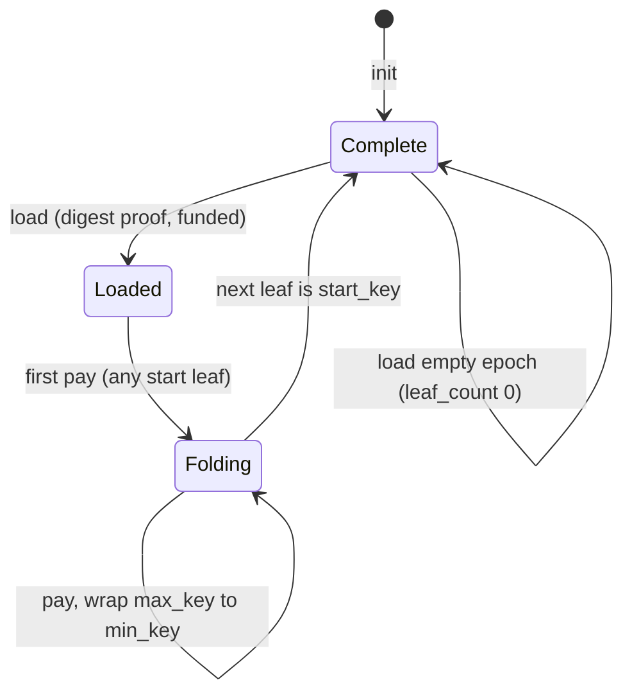
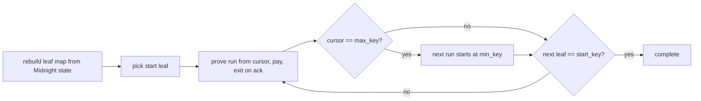

<!--
 Copyright Midnight Foundation

 Licensed under the Apache License, Version 2.0 (the "License");
 you may not use this file except in compliance with the License.
 You may obtain a copy of the License at

     https://www.apache.org/licenses/LICENSE-2.0

 Unless required by applicable law or agreed to in writing, software
 distributed under the License is distributed on an "AS IS" BASIS,
 WITHOUT WARRANTIES OR CONDITIONS OF ANY KIND, either express or implied.
 See the License for the specific language governing permissions and
 limitations under the License.
-->

## Abstract

This proposal defines how Midnight block production rewards are paid in
NIGHT on Cardano. Midnight observes block production and computes what each
participant earned. Cardano holds the tokens, and holds a *Midnight virtual
account* for each recipient. The account accrues the recipient's NIGHT and
holds ADA for the transaction fees of each payout. An account with too
little ADA for those fees is *unfunded*, and it is not paid.

This proposal adds a rewards pallet, `pallet_block_rewards`, to the
Midnight runtime. Each epoch, the pallet computes the NIGHT earned by each
stake pool that produced blocks and splits it between the pool's operator
and its delegators in the same proportions as Cardano staking rewards. It
then builds a Merkle tree over the recipients that are payable, which are
those with a funded account and a balance above a threshold the account's
owner chose, and publishes the root in a Midnight block. Cardano contracts
accept the root through the committee bridge of MIP-xxxx, which this
proposal requires. Earnings that are not yet payable accrue in node state.

On Cardano, three unprivileged roles move the value: anyone may release
the reserve into a rewards pool up to one interval's worst-case draw,
anyone may act as batcher and pay a proven run of leaves into recipients'
accounts, recovering the transaction fee in ADA from those accounts and
earning a flat distribution fee in NIGHT per leaf, and a user registers
once with the stake key and withdraws at any time. The node's data pump
runs the release and loads each epoch's digest, with the fees paid from
one rewards funding pool. Per-epoch settlement needs a longer epoch than today's 30
minutes; the companion bridge MIP raises it.

## Motivation

Midnight blocks are produced by Cardano SPOs, and the stake that selects
them is delegated ADA, which remains the case until NIGHT staking exists. To
keep incentives aligned, Midnight rewards follow the same split as Cardano
staking rewards. Most NIGHT liquidity is on Cardano, so paying rewards
there puts them where users already trade, with no bridging step.

The alternative rejected up front is to pay SPOs and let them pay their
delegators. That makes a delegator's reward discretionary: whoever governs
the intermediary decides who gets the tokens, and the people whose stake
earned them hold no claim any protocol will honor (the Rationale gives a
recent case). Delegated stake is what makes an SPO eligible to produce
Midnight blocks, so a delegator who cannot rely on being paid has less
reason to delegate to a Midnight producer. The split has to be a protocol
rule.

## Specification

The two chains learn about each other by different mechanisms. Midnight uses
direct observation: every node follows and validates Cardano while validating
a block, so Cardano state reaches Midnight with no one carrying it.

The return direction goes through the committee bridge of MIP-xxxx, which
this proposal requires. The bridge keeps a light client on Cardano that
holds the latest MMR root the Midnight committee signed, and that root
commits to every Midnight block. This proposal uses it in one way: the
rewards digest is a transaction in a Midnight block, and a Cardano
contract accepts the digest when it comes with a Merkle inclusion path to
the root in the light client. Cardano nodes never follow Midnight.

### Where state lives and who acts

Authority is split by what each chain can observe. Midnight is the authority
on what was earned, because block production is visible only there. Cardano
is the authority on who holds an account and holds the value, because the
accounts and the tokens are Cardano UTXOs.

**State on Midnight.**

- Block production per epoch.
- The undistributed allocation that the reward rule is applied to.
- The reward computation and its Cardano-derived inputs, read from final
  Cardano blocks: the stake snapshot, pool parameters, deposit balances,
  registrations and deregistration flags.
- Accrued earnings of recipients that are not currently payable.
- The reward digest, a transaction in a block whose header the BEEFY MMR
  commits to.

**State on Cardano.**

- The reserve: NIGHT not yet in circulation.
- The rewards pool: released NIGHT not yet paid.
- The rewards funding pool: ADA that pays the fees of the release and the
  epoch load. It is one pool, built as the committee bridge MIP defines;
  the bridge has a pool of its own.
- Two UTXOs per recipient. The deposit UTXO holds the account's ADA and
  accrued NIGHT. The registration UTXO holds its owner, reward
  destinations, operator keys and payout threshold.
- The batcher state UTXO: the loaded epoch, its root, and the cursor over
  the sorted leaves.
- The fee schedule UTXO: the Midnight-published cap on what a batch of
  each size may take from an account, the distribution fee, and the cap
  on the epoch load fee.
- The committee bridge light client UTXO: the latest quorum-signed MMR
  root.

**Agents.** A Cardano contract only validates, so every step on Cardano
needs an agent that submits the transaction.

- The rewards pallet: computes each epoch's rewards, publishes the digest
  and the fee schedule, acknowledges deregistrations.
- The data pump: a component of every consensus node, defined in the
  committee bridge MIP. One module advances the bridge light client, one
  submits the reserve release, and one loads each epoch's digest into
  the batcher state; none pays a fee from a wallet.
- A batcher: pays a loaded epoch's leaves in batches; permissionless,
  interchangeable, replaceable mid-fold.
- A user: registers with a payout threshold, tops up, withdraws NIGHT,
  deregisters.
- Midnight governance, which spans both chains: upgrades the reserve and
  pool logic on Cardano and sets `max_fee`; sets the fee schedule as a
  runtime parameter, which reaches Cardano through the bridge like the
  digest; cannot reach the accounts, the batcher state or the fee schedule
  UTXO, which are fixed.

**Order of the flow.** A reward begins in pallet state and ends spendable on
Cardano, and the steps between are these.

1. A block is produced. The pallet computes that block's base reward from
   the undistributed allocation, splits it between the producing pool and
   the Treasury on the block's utilization, and decrements the allocation by
   the whole base reward. This runs every block, because both the
   allocation and the utilization change with each one.
2. The epoch ends. The pallet divides each pool's accumulated share across
   the pool's operator and its delegators, using the stake snapshot and pool
   parameters that hold for the epoch. Running that division once on the
   epoch total gives the same result as running it per block, since the
   split ratio is fixed for the epoch. The pallet then selects the epoch's
   tree (see Tree selection). A selected recipient carries its whole
   accrued balance into the tree, and the rest keep their balances in
   pallet state.
3. The pallet submits the digest, the tree's root and key range, as a
   transaction in a block at or after the epoch boundary.
4. BEEFY finality commits that block's header, and with it the
   transaction, into the MMR, and the data pump advances the committee
   bridge light client to an MMR root at or beyond it, with the funded
   update of the following session.
5. The data pump, or any other party, submits the reserve release for the
   interval, moving into the rewards pool what the interval's worst case needs beyond what the pool
   already holds.
6. The data pump loads the epoch into the batcher state with a digest
   proof against that root. Any party acting as batcher then pays the
   leaves in batches until the
   fold completes. Each recipient's NIGHT lands in its deposit UTXO, less
   the distribution fee, which the batcher keeps; the batch that
   completes the fold also pays the epoch's Treasury total to the
   Illiquid Circulation Supply.
7. The recipient withdraws its NIGHT whenever it chooses.

Midnight reads only final Cardano blocks, about 12 hours behind the tip,
so a new account enters selection at the first Midnight epoch end after
its registration is final: two to three epochs after the registration
(see Cardano observation lag). Steps 4 through 6 have no deadline: the
latest MMR root proves any earlier digest, so a delayed fold loses
nothing.

### Prerequisites

The Committee Bridge Consensus Integration MIP has to land first. It makes
the BEEFY committee handover consensus-enforced on Midnight and verifiable
by a light client on Cardano, it defines the data pump and the funding
pool that this proposal reuses for the reserve release and the epoch
load, and it raises the
epoch to six hours, which this design assumes.

### Reward split parameters

For each Midnight epoch, a pool's NIGHT is split between its operator and
its delegators in the proportions of Cardano's leader and member rewards.
The operator takes the pool's registered margin. The remainder is divided
pro rata by delegated stake in the Cardano snapshot the epoch's committee
was selected from, with the pledge counted as the operator's stake. The
pool's fixed cost is not applied, because it is an ADA amount.

### Reward computation on Midnight

Block production is observable only on Midnight, so Midnight is the
authority on who produced which blocks. The rewards pallet applies the
published reward rule to each block as it is produced. When the epoch
closes, it applies the split above to each pool's accumulated share.

**The rule.** The base reward for a block is the outstanding reserve times
the base distribution rate, `Nb = Bo × R`, with `R = 2.8π ÷ γ` from the
published derivation (Appendix A). It divides by block utilization: a fixed
subsidy `Nf = Nb × Sᵣ` reaches the producer whatever the block contains,
the variable remainder is shared with the on-chain Treasury in proportion
to utilization `U` as `Nv = U × (Nb − Nf)`, and the producer's actual
reward is `Na = Nf + Nv`, bounded below by `Nf` and above by `Nb`. The
subsidy rate `Sᵣ` is 95% at launch, adjustable by governance, with a
stated expectation of moving toward 50%. The whole base reward leaves the
reserve at every block whatever the utilization, because the portion the
producer does not earn is paid to the Treasury rather than retained:
utilization decides destinations, and the size of the draw comes from `R`
alone.

**The undistributed allocation.** The figure `R` applies to is pallet
storage: the block-rewards allocation as it stood at genesis, less every
base reward distributed since. It is a deterministic function of a
published constant and the production history, so every node reaches the
same value from chain state, and anyone with the block history can
reproduce it. It decrements by `Nb`, the whole base reward, since the
Treasury's portion leaves the reserve alongside the producer's.

**The per-block split routes tokens.** With `Nb` fixed, the producer's
share is `Na` and the Treasury's is `(1 − U)(Nb − Nf)`, both computed by
the pallet from the block it has just seen. The two shares are owed on
different chains: the producer's share travels to Cardano whole and is
apportioned there among the pool's operator and its delegators, which
moves nothing across the boundary, and the Treasury's share reaches the
Illiquid Circulation Supply (see Token flow and conservation).

**Integer arithmetic.** Balances are whole STAR, a millionth of a NIGHT.
`R` is configured as the integer pair `rn / rd` and the subsidy rate as
`sn / sd`; per block the pallet computes:

```
Nb = (Bo * rn) / rd                    // floor; Bo is STAR
Nf = (Nb * sn) / sd                    // floor; subsidy rate as sn/sd
Nv = ((Nb - Nf) * u_used) / u_max      // floor; utilization as a ratio
Na = Nf + Nv                           // producer
Nt = Nb - Na                           // treasury, by subtraction
Bo = Bo - Nb
```

Worked figures, rounding margins and termination are in Appendix A.

**Entitlement.** Earnings accrue whether or not the recipient has an
account; account state governs payability only. A recipient not in the
epoch's tree (no account, deposit below the funded floor, balance below
its payout point, or no room) accrues in pallet state until a payout
lands. Balances never expire.

### Tree selection

The tree is a schedule, not a snapshot: Cardano's block capacity cannot
pay every potential recipient every epoch (Appendix B). `max_leaves` is
the most entries a tree may carry.

**Eligibility.** Every account carries a `payout_threshold`, a
non-negative whole number of STAR that its owner sets in the registration
UTXO. The protocol has no default. A wallet may prefill a value, which is
user experience and not protocol. The threshold is an amount above the
distribution fee: an account is eligible when it is funded and its
accrued balance is at least `dist_fee + payout_threshold`. At a threshold
of zero an account is eligible as soon as its balance covers the fee.

**Closing accounts first.** An account whose owner has asked to close it
enters the next tree ahead of the rotation, with its whole remaining
balance, whatever that balance is. Its registration is gone, so it has no
threshold, and its leaf is the exit that closes the account at the next
fold. If the closing accounts alone exceed `max_leaves`, they enter in
key order and the rest enter the following tree.

**One reading per epoch.** At the Midnight epoch boundary where it builds
the tree, the pallet reads its inputs at one point in time: deposits,
registrations with their thresholds, deregistration flags, and
`dist_fee`. The tree follows that reading alone. A change made and replaced between two
readings has no effect, so an owner may change the threshold as often as
they like.

**Rotation.** The pallet keeps one cursor over all accounts in ascending
order of the 28-byte stake key hash. The cursor persists across epochs
and wraps at the end. Each epoch, after the closing accounts, the pallet
walks forward from the cursor and adds every eligible account it meets,
with its whole balance, until the tree holds `max_leaves` or every account
has been considered once. An
account that is not eligible when the cursor reaches it has used its
turn, and is considered again on the next rotation. The tree therefore
holds `min(closing + eligible accounts, max_leaves)` leaves. A tree below the cap is
a smaller tree and nothing else; the epoch stays six hours.

Everything omitted keeps accruing. Balance orders nothing: amount enters
only through the account's own threshold. Every leaf carries the
distribution fee, except an exit leaf smaller than the fee (see The
batcher).

`max_leaves` is derived from `cardano_share`, the fraction of Cardano's
block capacity these payouts may occupy, and the measured cost of a
batch. This MIP sets `cardano_share` to 5% and `max_leaves` to 5,000,
both placeholders (Appendix B).

### Leaf, tree and digest

**Reward leaf.** One leaf per included recipient, 45 bytes, fixed layout:

```
leaf = ack(1) ‖ stake_key_hash(28) ‖ amount(16, u128 big-endian)
```

- `ack` is `0x00` normally. It is `0x01` when Midnight acknowledges a
  pending deregistration observed on the account's deposit UTXO. An ack
  leaf is emitted exactly once per account, its amount includes any
  pending balance, and the account is dropped from later trees.
- `stake_key_hash` is the 28-byte hash of the Cardano stake credential
  (key or script). It names the deposit UTXO to pay.
- `amount` is the gross amount in cNIGHT token units, the same unit as
  ledger STARs, before the distribution fee. It may be zero on an ack
  leaf.

Leaves are sorted ascending by the 28 key bytes and unique per key.

**Reward tree.** `leaf_hash = keccak256(leaf)`, `node = keccak256(left ‖
right)`. Pairs merge left to right per level and a trailing odd node is
promoted unchanged, which is `binary_merkle_tree::merkle_root::<Keccak256>`
from polkadot-sdk. Keccak-256 keeps the reward tree in the same hash
family as the BEEFY MMR and committee commitment.

**Reward digest.** At or after the first block of epoch `E + 1` the
rewards pallet (`pallet_block_rewards`, replacing the retired mNIGHT
payout pallet of the same name) submits a bare inherent transaction:

```
pallet_block_rewards::submit_rewards_digest {
    epoch:          u64,   // E, the partner-chains sidechain epoch
    leaf_count:     u64,
    root:           [u8; 32],
    min_key:        [u8; 28],
    max_key:        [u8; 28],
    treasury_total: u128,  // Σ Nt over the epoch's blocks, in STAR
}
```

`min_key` and `max_key` are the first and last leaf keys. `treasury_total`
is the epoch's Treasury share, which the batch completing the fold pays to
the Illiquid Circulation Supply (see Token flow and conservation). An
empty epoch publishes `leaf_count = 0` with a zero root and zero keys, and
may still carry a non-zero `treasury_total`. The full map is not published.
Any node reconstructs it from chain state, and batchers build their own
proofs from it. There is no leaf for the batcher; its fee comes off each
leaf it pays.

The exact byte layout of the extrinsic (125 bytes on the wire) is pinned
in the contract specification in `midnight-reserve-contracts`; the pallet
index is pending confirmation by the node team.

The block header commits to every transaction of the block through
`extrinsics_root`, and the BEEFY MMR commits to every finalized header, so
the digest is provable on Cardano through the committee bridge.

### Cardano observation lag

Every Cardano-derived input to the rewards pallet (deposit balances,
registrations with their payout thresholds, deregistration flags) comes
from Cardano blocks the node's data source treats as final: at least `k`
blocks below the tip, about **12 hours** (Appendix A). The pallet reads
these inputs at one point in time, the Midnight epoch boundary where it
builds the tree, and what it reads is the final Cardano state at that
time. A user action
becomes visible to the tree no earlier than the first Midnight epoch that
starts after that window, and its effect lands on Cardano after the
bridge update of the following session and the fold: roughly 12 hours
plus three epochs plus the fold, worst case.
Committee-selection inputs lag further (two Cardano epochs,
10 to 15 days) but do not gate payouts. The account and batcher state
machines are drawn in Appendix C.

### Token flow and conservation

NIGHT exists in three states, in reserve, locked and unlocked, on each of
the two chains: `C.R`, `C.L`, `C.U` on Cardano and `M.R`, `M.L`, `M.U` on
Midnight. Four movements make up the flow.

1. **Release.** The reserve contract pays NIGHT into the rewards pool, so
   `C.R` falls and `C.U` rises. The tokens are in circulation on Cardano
   from that moment, whether they are sitting in the pool or in a
   recipient's account.
2. **Observation.** About 12 hours later Midnight observes that release and
   matches it, moving the same amount from `M.R` to `M.L`. `M.R` is a
   delayed image of `C.R` and moves for this reason and no other.
3. **Payout.** A batch moves NIGHT from the pool into recipients' deposit
   UTXOs. Both endpoints are `C.U`, so neither chain's totals change.
4. **Treasury settlement.** The batch that completes the fold sends the
   epoch's `treasury_total`, committed in the digest, from the pool to the
   Illiquid Circulation Supply, which is `C.U` to `C.L`. Midnight observes
   that deposit through the existing bridge direction and moves the same
   amount from `M.L` to `M.U`, crediting the `treasury` pot. The Treasury
   holds NIGHT on Midnight, and a token unlocked on Midnight is locked on
   Cardano, so the ICS is the only endpoint that satisfies the invariants
   for that share.

The reserve has one release path, into the pool, and the pool has two
destinations: recipient accounts and the ICS. The distribution fee moves
nothing across the boundary: it is `C.U` to `C.U`, from the recipient's
leaf to the batcher's output.

`M.R` and `M.L` are the ledger's `reserve_pool` and `locked_pool`, moved by
privileged system transactions and checked by
`check_night_balance_invariant`, which requires UTXO value plus
`locked_pool`, `reserve_pool`, `block_reward_pool`, treasury NIGHT,
unclaimed rewards and contract-held value to total exactly 24 billion, and
rejects any system transaction that would break it. The pallet's
undistributed allocation is separate storage and takes no part in that
check. Expressing the observation movement needs a new privileged
transaction: `DistributeReserve` moves `reserve_pool` into
`block_reward_pool`, the pot for paying recipients on Midnight, and
`DistributeNight` pays out of it, both belonging to settlement on Midnight.
Settling on Cardano needs `reserve_pool` to fall and `locked_pool` to
rise, which no system transaction expresses today. The addition is on the
critical path, because the balance invariant is what rejects a block whose
awards the ledger cannot account for.

### Pool ceiling (flow limit)

The reserve contract holds the reward reserve and admits a release of NIGHT
into the rewards pool no more than once per interval. The interval is one
Midnight epoch. The release is not the emission curve. The published base
distribution rate is a per-block rule, and the rewards pallet is what
enforces it, block by block. The release contract's job is narrower: keep
the pool at a ceiling high enough that the interval's payouts can be met
even if every slot in the interval produces a full block, without knowing
what the interval will produce. Since `Na ≤ Nb` with equality on a full
block, and the Treasury takes the rest of `Nb` in any case, the worst case
is every slot drawing `Nb`. The ceiling is that draw, computed from the
reserve balance in the transaction being validated, and a release fills
the pool up to it:

```
N                 = slots per interval (interval_ms / blocktime), × k for catch-up
ceiling(Bo, m)    = Bo × (1 − (1 − R)^m)
release           = min(reserve_balance, ceiling(reserve_balance, N·k) − pool_balance)
```

Rewards decay, so a ceiling computed from the live reserve is always at
least the next interval's full-production draw, and a pool filled to it
never starves a fold (see Rationale).

**Integer form.** The ceiling needs a factor for `N` blocks,
`kn / kd ≥ 1 − (1 − R)^N`, computed off-chain at configuration time and
rounded up. The release is then a ceiling division:

```
ceiling = (reserve * kn + kd - 1) / kd   // ceil
release = min(reserve, ceiling - pool)   // clamped at zero
```

The factor is rounded up so the ceiling stays above the sum of floored
per-block draws. Catch-up over `k` missed intervals applies the factor
`k` times. Figures at `π = 3%` are in Appendix A.

Nothing in the contract initiates a release: anyone may submit a release
transaction, and the validator checks the elapsed time against the
transaction's validity range, allows several missed intervals to be
released at once, and caps the released amount at the reserve balance.

The release is a data pump job of the kind the committee bridge MIP
defines. The reserve's `ReleaseState` records `max_fee` beside
`last_release_time`, and the rewards funding pool pays the release's
fee: the pool's ADA falls by no more than the fee, and the fee is no
more than `max_fee`. The reserve-release module of the data pump
submits the release each interval from every consensus node.
`last_release_time` is its marker, a field the release already needs, so
when one node's release lands the others see the interval done and do not
retry. Anyone else may still submit. Block producers are the expected
funders of the pool, because without a release there is nothing to pay
them. With an empty funding pool the release waits and payouts wait with
it. Nothing is lost, and releases resume when the pool is refilled.

The schedule runs on Cardano time rather than Midnight block height. If
Midnight halts, the pool fills to one interval's worst case and nothing
pays out. This is accepted. The release is a **flow limit** and makes no
attempt to meter actual rewards. Its purpose is to bound the worst-case
exfiltration to the pool balance (see Security Considerations).

### Cardano contracts

Six on-chain pieces. The two that hold governance-controlled value use
the existing forever / two-stage / logic upgrade pattern from the reserve.
The four that hold user value, fold state, Midnight-published data or fee
ADA are fixed, so governance cannot reach user NIGHT.

| Piece | Role | Upgradable |
|---|---|---|
| Reserve v2 | Existing reserve, new logic: timed release into the pool, its fee paid from the funding pool under `max_fee` | Yes |
| Rewards pool | Holds released NIGHT. Value leaves only through a batch payout | Yes |
| Batcher state | One UTXO: current epoch, reward root, cursor over the sorted leaves; the epoch load is paid from the funding pool under `max_fee` | No |
| Fee schedule | One UTXO: Midnight-published skim cap per batch size, the distribution fee and the epoch load fee cap, a reference input of every batch and load | No |
| Virtual account | Per stake key: a deposit UTXO and a registration UTXO | No |
| Rewards funding pool | ADA that pays the fee of a release or an epoch load, and nothing else, each under its `max_fee`; anyone may add to it | No |

**Rewards funding pool.** One pool serves both of this proposal's data
pump jobs. It is built as the committee bridge MIP's funding pool is: ADA
leaves it only in a transaction that carries a valid release or a valid
epoch load, only as that transaction's fee, and by no more than that
job's `max_fee`. The bridge's own pool is separate and pays for
light-client updates alone.

**Rewards pool.** Value UTXOs at the pool address hold ADA and NIGHT. The
pool accepts value from a reserve release and disburses only inside a
transaction validated by the batcher state script.

**Batcher state.** One UTXO, identified by an NFT, whose datum is:

| Field | Meaning |
|-------|---------|
| `epoch` | Last loaded Midnight epoch |
| `root`, `min_key`, `max_key` | From that epoch's digest |
| `start_key` | First leaf key paid in the current epoch |
| `cursor` | Last leaf key paid |
| `complete` | True between epochs |

There are two transitions, both permissionless:

- **Load** opens an epoch. The spender presents the digest proof (see
  Digest proof on Cardano). The new epoch must be exactly `epoch + 1` and
  `complete` must be true. The load writes the digest's root and keys,
  clears `start_key` and `cursor`, and sets `complete` to false; an empty
  epoch stays complete. The load is a data pump job of the kind the
  committee bridge MIP defines: the rewards funding pool pays its
  fee, the pool's ADA falls by no more than the fee, and the fee is no
  more than the `max_fee` of the fee schedule. The
  epoch-load module of the data pump submits it from every consensus node
  once the light client proves the digest; `epoch` is its marker. Anyone
  else may submit it.
- **Pay** continues the fold. The first batch of an epoch starts at any
  leaf, and `start_key` becomes the first leaf paid. Every batch proves a
  contiguous run of leaves, in key order, adjacent to `cursor`. When
  `cursor` reaches `max_key` the next batch starts at `min_key`, which
  can happen only once per epoch. The fold is complete when the next leaf
  would be `start_key` again.

Every batch is checked against the same rules:

- The leaves are proven by one multiproof against `root`, and the proof
  shape forces the revealed leaves to be one contiguous, ascending run.
  Leaves cannot be skipped or paid twice.
- Every paid leaf maps to one deposit UTXO input carrying the NFT named
  by that leaf's key, and one continuing deposit output with the NIGHT
  added. An ack leaf is instead an exit (see Midnight virtual accounts).
- Inputs and outputs pair one to one, the batcher's own included: each
  paid leaf's deposit input has one output, the continuing deposit or,
  for an ack leaf, the refund, and the batcher brings an input of its own
  for the output that collects its fees. There is always one input per
  output, which is what keeps the pairing rules simple. Every pair's
  output holds no more ADA than its input, and a deposit pair's
  difference is at most `max_skim[n]` for the `n` leaves paid (see The
  batcher).
- Every paid leaf's output gains `amount − fee` in NIGHT, where `fee` is
  `dist_fee`, read from the fee schedule, if `amount ≥ dist_fee`, and
  zero otherwise. Tree selection makes every leaf at least the
  `dist_fee` it read, except an exit leaf.
- The pool's NIGHT decreases by exactly the sum of the paid amounts, plus
  `treasury_total` to the ICS in the batch that completes the fold. The
  fees are what remains, and they land in the batcher's own pair.
- The batcher state output carries the advanced cursor.

**Fee schedule.** One UTXO, identified by an NFT, whose datum holds the
list `max_skim[n]`, the most lovelace a batch of `n` accounts may take
from each of them; `dist_fee`, the flat NIGHT fee on a leaf; and
`max_fee`, the most lovelace an epoch load may take from the funding
pool. All three are Midnight runtime parameters. The
pallet submits them as a transaction whenever governance changes them,
and the schedule UTXO accepts a replacement datum only with a bridge
proof of that transaction, the same proof shape an epoch load uses.
Every batch and every load reads it as a reference input. The batcher
state is fixed and has no governance of its own, so its fee cap travels
with the schedule. The script reads the schedule at fold time while
Midnight built the tree earlier, so a change between the two shifts what
a recipient nets; Midnight sets the values, so it controls when that
happens.

### Digest proof on Cardano

The committee bridge light client is one UTXO whose datum holds
`latest_mmr_root`, the most recent quorum-signed BEEFY MMR root. The
batcher state script reads it as a reference input and never spends it.
To prove the digest of epoch `E`, submitted as a transaction in block `N`:

1. The BEEFY MMR leaf for block `N + 1` carries `parent_number = N` and
   `parent_hash = blake2b_256(header_N)`. A positional MMR inclusion proof
   ties that leaf to `latest_mmr_root`.
2. The raw SCALE-encoded `header_N` is supplied and its hash is checked
   against `parent_hash`; `extrinsics_root` is read from it.
3. A Substrate trie inclusion proof (`sp_trie::LayoutV1`, blake2b-256)
   binds the transaction bytes to `extrinsics_root` under the
   transaction's index in the block.
4. The bytes are decoded as the bare `submit_rewards_digest` call, which
   yields `(epoch, leaf_count, root, min_key, max_key, treasury_total)`.
   The contract accepts the digest from any block; only epoch succession
   is enforced.

Because every MMR root commits to all earlier blocks, the latest root
proves any past digest. Only the epoch load and a fee schedule update
read the light client, so batches never contend with root updates. A
load built against a datum that an update has just replaced fails
Cardano's first validation phase, costs nothing, and is rebuilt. A
delayed fold loses nothing.

### The batcher

The batcher is any party that runs the fold, across as many transactions
as Cardano limits require. Batchers are interchangeable, and contention
between them is ordinary UTXO contention. A batch pays its transaction
fee out of the ADA deposits of the accounts it pays, under two rules the
batcher state script checks over the transaction's inputs and outputs,
which pair one to one:

```
every pair       ADA in ≥ ADA out
deposit pair     ADA in − ADA out ≤ max_skim[n]    // n = accounts paid
```

The ledger already makes the fee the sum of `ADA in − ADA out` over all
pairs. The first rule applies that per pair, the batcher's own included,
so no output takes ADA from another input and the batcher cannot gain
ADA; what the deposits do not cover, the batcher's own pair pays. On
Cardano the transaction creator sets the fee, so the first rule alone
would let a hostile batcher pay one account at an enormous fee and charge
it the whole amount; the second rule is what bounds that (see Rationale).
`max_skim` is a list indexed by batch size, read from the fee schedule
UTXO, and Midnight sets its entries: at the target batch size an entry
covers the real per-account share of a fee, and below it the entries sit
under what such a batch really costs per account, so a small batch is
buildable at the batcher's expense. There is no minimum batch size.

**Distribution fee.** The batcher's upside is a flat NIGHT amount
`dist_fee` per leaf paid, deducted from the leaf's gross amount by the
script and left in the batcher's own pair: the recipient receives
`amount − dist_fee` and the batcher keeps `dist_fee`. The script deducts
it whenever the amount is at least the fee. Tree selection guarantees that
for every leaf except an exit leaf with a smaller balance, which carries
no fee. A payout therefore nets its recipient at least the account's
`payout_threshold`, unless `dist_fee` changes between the tree and the
fold (see Fee schedule). The batcher's return is `n × dist_fee`, linear in the
leaves paid, with no break-even, because the skim has already zeroed the
ADA side. Every leaf is worth the same, so no range of the tree is better
to fold than another. Each batcher keeps the fees of the leaves in its own
batches. Per-epoch cost to recipients is bounded by
`max_leaves × dist_fee`. The value is open (see Open Questions).

### Midnight virtual accounts (registration)

To receive rewards, a user (SPO or delegator) registers a **Midnight
virtual account** on Cardano. Registration proves ownership of the stake
credential and posts an ADA deposit (minimum 10, cap 40) that funds
batcher skims. A key credential signs; a script credential authorizes by
a withdrawal from the script in the same transaction, so a DApp whose
stake credential is a script registers and withdraws like any user, and
its own logic decides what it does with the NIGHT. The stake key is the account's identity and controls the
deposit. It cannot be changed on an existing account. To move to a new
stake key, deregister and register again.

An account is **two UTXOs under one minting policy**, distinguished by NFT
name. `skh` is the 28-byte stake key hash:

| NFT name | UTXO |
|---|---|
| `0x00 ‖ skh` | Deposit UTXO, the batcher zone |
| `0x01 ‖ skh` | Registration UTXO, the user zone |

Nothing links the two on chain beyond the shared name. Midnight pairs them
by `skh`. The batcher never reads or spends the registration UTXO.

- **Deposit UTXO.** Holds the ADA deposit and the accumulated NIGHT. Its
  datum is `{ cred, next, committed }`, where `cred` is the stake
  credential, `next` is the next key in the list, and `committed` is
  `None` or `Some(refund_address)`. Deposit UTXOs form an on-chain linked
  list sorted by `skh`, with a head and a tail sentinel; an insert must
  land between its predecessor and successor in key order. Payout order
  follows the sorted leaves, not the list.
- **Registration UTXO.** Holds `{ owner, destinations, operator_keys,
  payout_threshold }`, the contract specification's schema with the
  payout threshold added: the owner payment credential that may edit the record; the weighted
  destinations of the account's rewards, each a DUST-generation address
  or a NIGHT address; the operator keys, empty for an account that is not
  a block producer; and the payout threshold of Tree selection. The owner
  credential may rotate itself.

User transitions:

| Action | Auth | Rule |
|---|---|---|
| Register | stake key | one transaction mints both NFTs, inserts the deposit in key order with 10 to 40 ADA and zero NIGHT, and creates the registration, which must state a `payout_threshold ≥ 0` |
| Withdraw | stake key | the full NIGHT balance, to any address; ADA unchanged; allowed only while `committed = None` |
| Top up | stake key | ADA only; the top-up is at least 10 ADA and the result is at most 40 ADA; allowed only while `committed = None` |
| Update registration | owner | edit the registration datum; `payout_threshold` stays non-negative; no limit on how often |
| Deregister | stake key and owner | one transaction burns the registration NFT, tops the deposit up to at least 10 ADA if it holds less, and sets `committed = Some(refund_address)`; allowed only while `committed = None`. After this the user cannot spend the deposit at all |

There is no standalone registration delete, so a registration NFT exists
exactly when its deposit exists with `committed = None`.

**Exit.** Once `committed` is set the deposit accepts only batch payments;
the user can neither withdraw nor top up, and accrued NIGHT waits on the
deposit for the exit. The top-up on deregistration keeps the deposit above
the funded floor, so Midnight always emits the ack leaf. Midnight observes
the flag, includes the account's final balance in the next tree with
`ack = 0x01`, and drops it from later trees. The batcher pays that leaf by
unlinking the deposit from the list (spending its predecessor), burning the
deposit NFT, and sending all ADA and NIGHT, less the skim and, if the
leaf amount covers it, the distribution fee, to `refund_address`. The
deposit stays in place until then, so every leaf stays payable and the
fold cannot be stalled by a user. A new registration for the same stake
key is possible only after the exit.

**Funded floor.** Midnight treats a deposit as funded while it holds at
least the funded floor, indicatively 3 ADA and a protocol parameter.
Below the floor the account leaves the tree and its earnings accrue in
node state until a top-up is observed.

Midnight reads the registration UTXO first and falls back to existing
`cnight_generates_dust` records. NIGHT held in a deposit UTXO generates
DUST for the DUST destinations of the paired registration, the same way
cNIGHT holdings do today.

### Parameters

| Parameter | Proposed | Set in | Notes |
|---|---|---|---|
| `cardano_share` | 5% | Contract configuration, at deployment | Placeholder. A judgment about how much of Cardano's block capacity these payouts may occupy, not an engineering value |
| `max_leaves` | 5,000 | Pallet | Derived from `cardano_share` and the measured batches per block; recompute once a batch's execution cost is benchmarked |
| `payout_threshold` | Set by each account's owner; no protocol default | Registration UTXO | Non-negative STAR above `dist_fee`; an account is eligible at `dist_fee + payout_threshold`. A wallet may prefill a value |
| `max_skim[n]` | Real per-account fee share at the target batch size, about 10,000 lovelace at 25 to 40; under real cost below it | Fee schedule UTXO, Midnight-published | Indexed by accounts paid; bounds per-account drain to its largest entry (see Open Questions) |
| `dist_fee` | To be determined | Fee schedule UTXO, Midnight-published | Flat NIGHT fee per leaf paid, kept by the batcher; also the least balance a payout can have; per-epoch cost bounded by `max_leaves × dist_fee` (see Open Questions) |
| `max_fee`, release | To be measured | Reserve `ReleaseState` | Flat cap on the release fee that the funding pool covers; governance sets it with the reserve upgrade, and a release cannot change it |
| `max_fee`, epoch load | To be measured | Fee schedule UTXO, Midnight-published | Flat cap on the epoch load fee that the funding pool covers; the batcher state is fixed, so the cap travels with the schedule |
| Batch size `K` | 25 to 40 accounts | Batcher, per transaction | Bounded by Cardano transaction size and script budget, not chosen |
| Deposit minimum and cap | 10 and 40 ADA | Account scripts | Funds skims; returned when an account closes |
| Funded floor | 3 ADA | Pallet | Below it an account leaves the tree and keeps accruing |
| `kn / kd`, the interval factor | `≥ 1 − (1 − R)^N`, rounded up; `57,532,591,972,042 / 10^18` at `π = 3%`, `N = 3,600` | Reserve contract, compile-time | Sets the pool ceiling at one interval's worst case, which bounds the float and the exposure a compromised committee reaches |
| Release interval | One Midnight epoch, six hours | Reserve contract, in milliseconds | Epoch length is set by the committee bridge MIP |
| `R`, the base distribution rate | `2.8π ÷ γ`, pending `π` | Pallet as the integer pair `rn / rd`; reserve contract as `Ra` through the interval factor | Published derivation; `π` is to be determined (see Open Questions) |
| `Sᵣ`, the subsidy rate | 95% at launch | `LedgerParameters`, once added | Published, governance-adjustable, expected to fall toward 50% |
| Utilization target | 50% | `LedgerParameters`, once added | Published, governance-adjustable. Steers fee pricing toward half-full blocks; not in the reward formula, which uses observed `U` |

Everything in this table is a value to be chosen or measured.

## Rationale

### Pay delegators directly, not through the SPO

An intermediary that holds the stake also receives the tokens that stake
earns, so who ultimately gets them is decided by whoever governs the
intermediary, and that decision is rarely disinterested, because the
governing body usually holds a competing claim on the same tokens.

Liqwid's Glacier Drop allocation shows how narrow the margin can be. ADA
deposited in Liqwid's ADA market was included in the snapshot, and
18,813,699.9 NIGHT was claimed by Liqwid Labs as the DAO's technical
operator, which put eighteen allocation options to its LQ stakers. Those
options split the tokens in every combination across three claimants: the
ADA suppliers whose stake earned them, LQ stakers, and the Liqwid DAO
itself
([proposal thread](https://gov.liqwid.finance/t/liqwid-dao-night-airdrop-allocation/1957)).
The reasoning was that "As this ADA is pooled in a Liqwid DAO governed
smart contract it is a cashflow governed by the Liqwid DAO".

[Proposal 118](https://app.liqwid.finance/governance/proposal/118) ran with
two options in contention. Giving ADA suppliers 10% and the Liqwid DAO 90%
led on 882,528 LQ, 48.35%. Paying the suppliers in full drew 863,767 LQ,
47.32%. The remaining sixteen options took 78,847 LQ between them. The
proposal was canceled on 16 March 2026 and re-voted
([re-vote thread](https://gov.liqwid.finance/t/night-airdrop-allocation-re-vote/1981)).
The suppliers were paid in the end, but by a cancellation and a second
vote under community pressure rather than by any entitlement, with the
competing option a point ahead when the first vote was pulled.

### Merkle root, not a full list

Cardano needs only the root, the leaf
count and the key range. The map is recoverable from Midnight state.

### Cursor over bitmap

A bitmap of paid leaves in the datum was considered. A bitmap grows with the leaf count and had to ride
in every batch output, which capped an epoch near 50,000 recipients.
With sorted leaves, one contiguous multiproof per batch and a cursor,
the datum is constant size, leaves still cannot be skipped or paid
twice, and a random start plus one wrap lets competing batchers work
the same epoch without coordination.

### Transaction, not header digest

A `Consensus` header log was considered as the carrier of the digest. A
transaction in the block is
ledger-visible to every indexer and wallet, is produced by the pallet's
own inherent logic like the other Cardano observations, and is provable
on Cardano through `extrinsics_root` at the cost of one small trie
proof per epoch load.

### Push over pull

User claims against a shared root contend
and leave epochs unfinished, which blocks the next load. The fold is
deterministic, and withdraw-any-time keeps pull-style UX.

### ADA cost from deposits under a tight cap, NIGHT upside from the leaf

The principle is that an ADA cost is never compensated in NIGHT. Whoever
spends ADA on protocol work is made whole in ADA, so nobody has to judge
what NIGHT is worth against ADA. Here the accounts' deposits cover the
Cardano fee in ADA, at no profit to the batcher. The distribution fee in
NIGHT is a separate reward for the effort and stands in no relation to
the ADA spent. A design where the reward covers the fee has to hold an
exchange rate.

The cap has to be tight because the batcher is often an SPO. Cardano's
transaction fees go to the epoch's reward pot, and stake pool operators
and their delegators receive them. The parties with the strongest reason
to run a batcher are SPOs, and an SPO that pays a
Cardano fee gets a share of it back through Cardano's own rewards. So
a design that reimburses the batcher's fee from someone else's ADA, a
recipient's deposit or a shared pool, is not exposed to griefing but to
profit: the SPO sets the fee as high as the contract allows, the
deposit pays it, Cardano returns part of it to the SPO, and the user
loses what the SPO gains. That is why the skim is capped per account
by a Midnight-set schedule indexed by batch size, set to the real cost
of a well-formed batch and no more, why the batcher's own input/output
pair may not gain ADA, and why a pool that pays fees on the batcher's
behalf was not considered. The same constraint binds any future fee
reimbursement in this design.

That holds for the batcher. The light-client update, the reserve release
and the epoch load are different: each is one fixed transaction per
interval with no recipient deposits to draw on. The update is paid from
the bridge's funding pool, and the release and the load from the one
rewards funding pool (see the committee bridge MIP). The constraint
binds those pools too, which is why each job has a tight `max_fee`, in the
contract's own state or in the fee schedule it reads. Script cost is
deterministic, so each of these transactions costs nearly the same every
time, and a flat cap, measured in advance, holds the gap a padded fee can
take to a small margin.

### The epoch load is pumped, not folded

An earlier draft opened an epoch with its first batch, and the batcher
recovered the digest proof's cost from that batch's skims and fees. The
load is the one step of the fold with a fixed cost and no leaf to pay for
it, so folding it into a batch made the first batch dearer than every
other and gave each batcher a reason to wait for someone else to load.
As one funded transaction per epoch it has the shape of a data pump job:
the `epoch` field is its marker, every consensus node submits it once
the light client proves the digest, and the batcher only pays, so every
batch of an epoch is worth the same. The cap sits in the fee schedule
because the batcher state is fixed and has no governance handle of its
own, while the schedule already carries the batcher's parameters and
already reaches Cardano under a bridge proof.

### No minimum batch size

What any
batcher can take from an account is bounded per epoch by the largest
entry in the schedule, because the fold pays each leaf once, and a
one-account grief costs the griefer `fee − max_skim[1]` for every
account it touches. A minimum batch size would tighten that and was
rejected: a fold whose remainder could not be paid would stall the
epoch, which is worse than any grief the schedule leaves open.
Transaction size bounds the batch at roughly 25 to 40 accounts on
mainnet limits.

### Fee schedule on Midnight

The schedule belongs on Midnight. It is a runtime parameter that
governance sets, and it reaches Cardano by the same path as the digest:
a pallet transaction, proven through the committee bridge, that
replaces the fee schedule UTXO's datum. That keeps the parameter where
the others live and out of the batcher script, which this MIP makes
fixed rather than upgradable, so a value baked in at deployment could
never be revised. The costs are one more UTXO and proof shape on
Cardano, and that a batcher has to read the schedule before deciding
what batch size to build.

### Flat distribution fee, not a percentage

Serving an account costs
the same whatever its balance, one leaf, one deposit UTXO and one Merkle
path, so a proportional charge would tax large accounts to subsidize
small ones for identical service, and it would sit oddly beside an ADA
skim that is already a flat per-account cap. Under a percentage a
batcher's take would also depend on which accounts are in its range,
and batchers would race for the fat ranges and leave the thin ones.
Flat makes every leaf worth the same. The fee's share of a payout is the
owner's choice: a payout nets at least `payout_threshold`, so an owner
who wants the fee to be a small part of each payment sets a high
threshold.

### Fee from the recipient's balance, not the Treasury or the reserve

The Treasury share is `(1 − U)(Nb − Nf)`, which goes to zero as
utilization goes to one, so that source dries up in the busy epochs
that generate the most work. Taking it from the reserve would have the
pallet decrement `Bo` by the fee to stay reconciled with Cardano, a new
term in the published emission rule that pushes the cost onto future
recipients. Deducting from each leaf revises no block's computation,
claws nothing back from accrual, and keeps every leaf independently
computable with no dependence on the tree total or account count.

### Per-leaf fee, not a per-epoch lump

A single cut of the epoch's
NIGHT taken off the top has no size gradient and no answer for who
claims it when several batchers split the fold. Per leaf has both.

### Two UTXOs per account, unlinked

Batches never re-output
registration state, and user churn on the registration cannot contend
with payouts. A pointer between the two would drag the batcher into
every registration change.

The payout threshold sits in the registration UTXO for the same reason.
In the deposit UTXO, every change would spend the UTXO the batcher has to
reach, and would need a rate limit to stop an owner from stalling a fold.
In the registration UTXO a change touches nothing the batcher spends, and
the pallet reads the threshold at one point in time per epoch, so rapid
changes cost their owner fees and disturb nothing. No rate limit exists.

### Static stake key as identity

The stake key hash is the list key
and the NFT name, so one account per credential comes from the sorted
list with no second structure.

### Ack inside the leaf

Acknowledged deregistrations ride the reward
tree, so the fold forces the batcher to perform them, and no separate
ack channel is needed.

### Bounded user contention with the fold

The batcher must reach
every deposit UTXO in the epoch's tree, so the design limits how often a user can spend one:
withdrawals are always the full balance, so at most one per payout;
top-ups have a minimum and a cap; the deregistration flag is set once per
account lifetime and ends all user spends of the deposit. Registration
edits, threshold changes included, never touch the deposit. Deposit ADA
only ever decreases by skims and at exit, so the final balance Midnight
sees is at most a few skims above the live balance, and an underfunded
deposit still holds far more than one skim; a final ack leaf
is therefore always payable.

### The pallet keeps its own reserve figure

The undistributed allocation is not `M.R`. `M.R` is Midnight's delayed image of the Cardano
reserve and falls by observed releases, which are sized for worst-case
production; the undistributed allocation falls by rewards actually awarded.
The two hold different values whenever a release has run ahead of the
production it funds, and a reward computed from the mirror would vary with
release timing and observation lag. Filling the pool to its ceiling
rather than by a fixed amount, which nets each release against the pool
balance (see Pool ceiling) keeps them within one interval of each other.

`R` is rational by construction, so it is a numerator
and denominator rather than a decimal; at `π = 3%` and a six-second
blocktime, `Ra = 21/250`, `γ = 5,256,000` and `R = 7 / 438,000,000`
exactly. Every per-block quantity is a floored division, and the
Treasury's share is defined as the remainder rather than by its own
floored formula, which is what guarantees `Na + Nt = Nb` at every block.

### Payout schedule

The selection is a job scheduler, and it has to be fair and live: every
account is paid eventually, and large balances get no priority. A
global payout line with two cursors, one over the accounts above it and
one over the rest, was considered. A threshold chosen per account leaves
no global line to sort by, so one rotation serves every account, and
every leaf carries the fee.

**Closing accounts keep their priority.** The ack leaf is the account's
last: the batcher closes the account the next time it touches it, and
that is the whole of what the owner asked for. Putting the leaf in the
rotation would make that one action wait a full rotation for nothing in
return. A closure happens once per account lifetime, so the leaves it
takes from the rotation are few.

**Liveness.** The cursor visits every account once per rotation, and a
rotation that meets `E` eligible accounts takes at most
`ceil(E / max_leaves)` epochs. An eligible account is paid within one
rotation. An account below its payout point accrues until it crosses it
and is paid within one rotation after that. A larger population lengthens
the wait and drops no claim.

**Fairness.** A turn is used whether or not the account was eligible, so
no account is served twice before every other account has had its turn.
Balance plays no part in the order. Amount enters only through the
threshold the owner chose, which holds a small balance back until the
owner considers it worth a payment.

**Key order.** The order has to be deterministic, so that every node
selects the same tree from chain state, and the stake key hash is the
order the tree's leaves already have.

**Launch condition.** While the eligible accounts number at most
`max_leaves`, every one of them is in every tree and the rotation has no
effect. At 5,000 leaves that means every eligible recipient is paid every
six hours.

### Why the published invariants still hold

The tokenomics whitepaper (v1.81) publishes the invariants
over those six quantities, and the set it publishes assumes rewards paid on
Midnight: a release moves tokens from the Cardano reserve to Cardano locked,
Midnight observes it and moves the same amount from its reserve to Midnight
unlocked, under `C.R ≤ M.R` and `M.U ≤ C.L`. Paying on Cardano keeps the
published bound `M.U + C.U ≤ S` but changes which invariant governs the
released tokens, because those tokens end up unlocked on Cardano rather than
on Midnight, under `C.U ≤ M.L + (M.R − C.R)`. Both hold through the
observation window rather than in spite of it. `C.R ≤ M.R` holds because
Cardano's reserve falls first and Midnight's follows. `C.U ≤ M.L + (M.R −
C.R)` holds because the slack term is exactly the releases Midnight has yet
to observe: `C.U` rises at the release and `M.L` rises when Midnight sees
it, and the gap between the two reserves covers the interval between.

### Pool ceiling from the live reserve

Rewards decay, so the ceiling computed from today's reserve is always at
least the next interval's full-production draw, and a pool filled to it
never starves a fold. Deriving it from the live balance keeps it aligned
with the pallet's curve without either side tracking the other: a quiet
interval leaves the reserve fuller, and the next ceiling is computed from
that fuller reserve. Because the pool never holds more than one interval's
worst case, three things stay bounded. The pool balance is what a forged
digest could extract, so the exposure the flow limit exists to bound is
one interval. Released NIGHT counts as circulating supply from the moment
it leaves `C.R`, and circulating supply is what `π` is measured against,
so reported inflation stays within one interval of the published rate.
And the Cardano reserve stays within one interval of the undistributed
allocation, a gap that would otherwise need reconciling if reserve control
moved to Midnight as the whitepaper contemplates. The interval factor is
rounded up because the pallet floors each base reward, so the sum of
floored draws sits below the closed form and a ceiling rounded down could
leave the pool a few STAR short.

## Path to Active

### Acceptance Criteria

- Rewards pallet active in `midnight-node`, submitting digest and fee
  schedule transactions on a public testnet.
- Contracts deployed and audited, with the tests of the Testing section
  green.
- An independent batcher completing full-epoch folds on that testnet,
  including exits, a wrap, and the Treasury output.
- Releases and epoch loads submitted on that testnet by the data pump,
  with every fee paid from the rewards funding pool.
- Consolidated registration adopted by one wallet (Lace target).
- The committee bridge MIP active, including the epoch length change.

### Implementation Plan

Reaching Active is a staged rollout, each stage gated on the criteria
above: contracts and reference batcher on a Cardano test network against
a Midnight devnet; the node and ledger changes on the public testnet with
the contracts redeployed there; audit of the contracts and the pallet;
then mainnet, where the reserve logic upgrade lands before the runtime
upgrade that activates the pallet, so that the pool ceiling is in force
before the first digest is folded.

## Backwards Compatibility Assessment

No hard fork on either chain. Every change is a runtime upgrade on
Midnight or a contract deployment or governance upgrade on Cardano.

**Midnight runtime.** `pallet_block_rewards` replaces the retired mNIGHT
payout pallet of the same name; the runtime upgrade that installs it
carries the retired pallet's storage migration. The node's Cardano data
source gains two db-sync queries (per delegator stake and pool
parameters) and the inherent that carries them grows accordingly. The
node also gains the reserve-release and epoch-load modules of the data
pump. Nodes
that do not upgrade stop validating at the runtime upgrade, as with any
runtime change.

**Midnight ledger.** One new privileged system transaction (`reserve_pool`
to `locked_pool` on an observed release) and two new `LedgerParameters`
fields (`Sᵣ` and the utilization target). Both additive; the existing
`OverwriteParameters` transaction governs the new fields, and
`check_night_balance_invariant` is unchanged in form.

**Cardano contracts.** The reserve keeps its address, NFT and balance;
only its logic script changes, through the existing forever, two-stage,
logic upgrade pattern under the Council and Technical Authority. The
rewards pool, batcher state, fee schedule and virtual accounts are new
deployments with no predecessor. The governance upgrade that installs the
v2 logic also writes the reserve's `ReleaseState`, `max_fee` included. A
release carries `max_fee` forward and cannot change it.

**Registration.** The consolidated registration record is read first and
the existing `cnight_generates_dust` record second, so DUST generation
for holders who never register a virtual account is unaffected. A holder
gains reward delivery only by registering; nothing is required of holders
who do not.

**Epoch length.** The six-hour epoch this design assumes is delivered by
the committee bridge MIP together with its storage migration; this MIP
adds no epoch change of its own.

## Security Considerations

**The committee becomes a direct financial beneficiary of what it
signs.** When rewards were paid on Midnight, forging reward state meant
ratifying a chain honest nodes reject, so the forged value had no exit.
On Cardano, a dishonest two-thirds can BEEFY-sign a digest for a chain no
honest node follows, and the contract, which verifies signatures and not
chain validity, will pay it.

Mitigations:

- **Exposure cap.** The timed release is the brake on a compromised
  committee. What such a committee can extract is the rewards pool balance
  at the moment it attacks, not the reserve: the reserve validator admits
  one interval's release per interval and nothing a committee signs can
  open it faster. At a six-hour epoch and a 3% initial inflation the pool
  holds one interval's emission, on the order of 345,000 NIGHT against a
  6 billion NIGHT reserve, so a total committee compromise reaches roughly
  six thousandths of one percent of the reward allocation per interval it
  sustains. This is the firewall property of Gaži, Kiayias and Zindros
  applied to the reward path: a violation of Midnight's security assumption
  does not put Cardano-side assets beyond the pool at risk. The pool
  ceiling keeps that exposure at one interval; letting releases
  accumulate would raise it (see Pool ceiling).
- **Detection.** GRANDPA, BEEFY, and SPO keys are bound one-to-one at
  registration. A signer whose GRANDPA precommits finalize the canonical
  chain while its BEEFY signature commits to another is self-contradicted.
  The signature pair plus an MMR leaf mismatch proof identifies the SPO
  stake key, grounds for a future candidacy ban. Not covered: a consistent
  fork by a dishonest two-thirds, which is chain takeover and out of scope
  for any signature bridge. Detection is reactive, so the first theft
  succeeds. It deserves its own proposal.

**Fee extraction by an SPO batcher.** A batcher that is an SPO earns a
share of every Cardano fee it pays, so a padded fee reimbursed from
deposits would be profit rather than griefing. The fee schedule caps what
a batch may take from each deposit at the real cost of a well-formed
batch of that size, and the batcher's own input/output pair may not gain
ADA, so the most an SPO can extract from a deposit per epoch is the
schedule's largest entry and any excess fee is its own loss (see The
batcher and Rationale).

**Fee extraction from the rewards funding pool.** The same incentive
applies to whoever submits a release or an epoch load that the pool pays
for.
`max_fee` in the reserve's `ReleaseState` caps the fee of a funded
release, and `max_fee` in the fee schedule caps the fee of a funded load,
each at the measured cost of that transaction. The reserve admits one
release per interval and the batcher state one load per epoch, so the
most the pool loses to padded fees is the gap between cap and cost, once
per interval for each job. An empty funding pool delays releases or loads and loses
nothing: a later release catches up over the missed intervals, and a
delayed load still proves its digest against the latest MMR root.

Other: batcher misbehavior reduces to liveness. Leaf proofs, contiguity,
the cursor, and per leaf value checks prevent wrong, double, or skipped
payments, and anyone can resume the fold. User contention with the fold is
bounded (see Bounded user contention with the fold) and no mid-fold lock
is used. Registration replay fails on the stake-key signature.
Halt-induced reserve drift is bounded by the flow limit.

## Implementation

**`midnight-node`.** The rewards pallet (`pallet_block_rewards`): per-block
base reward and split in integer arithmetic, the undistributed allocation
in storage, per-epoch leader and member division from the stake snapshot
and pool parameters, the tree selection rotation with its persistent
cursor and its single epoch-boundary reading of thresholds and
`dist_fee`, the Keccak-256 sorted tree, the `submit_rewards_digest` inherent with
`treasury_total`, the `submit_fee_schedule` inherent, and deregistration
acknowledgement from observed deposit datums. The Cardano data source
gains the per delegator stake and pool parameter queries and the inherent
that carries them. The data pump of the committee bridge MIP gains its
reserve-release and epoch-load modules; the load module builds the
digest proof (MMR proof, header, `extrinsics_root` trie proof) from the
node's own block and MMR data.

**`midnight-ledger`.** The privileged transaction that mirrors an observed
release from `reserve_pool` to `locked_pool`, and `Sᵣ` and the
utilization target in `LedgerParameters`.

**`midnight-reserve-contracts`.** Reserve logic v2 with the pool ceiling
release and `max_fee`; the rewards funding pool; the rewards pool triple; the fixed batcher state script with the
funded load, the sorted multiproof, the digest proof
(MMR, header, `extrinsics_root` trie), the pairing and skim rules and the
distribution fee; the fee schedule UTXO; the virtual account scripts with
the sorted linked list and the
payout threshold in the registration; and the
TypeScript tooling for a reference batcher and the user flows.

**Wallets.** Lace, as the target, gains the register, top up, withdraw and
deregister flows, and the entry and later change of the payout threshold.

**Dependencies.** The committee bridge MIP for the light client this
design reads, the data pump that advances it and hosts the release and
load modules, the funding pool construction, and the six-hour epoch.

## Testing

**Contract invariants**, as property and unit tests on the Aiken scripts:
one deposit and one registration NFT per stake key hash; strictly
ascending keys along the list; every account input covered by exactly
one authority; a leaf paid at most once per epoch and never skipped;
`complete` only after every leaf from `start_key` around the circle;
epoch succession by exactly one; pool NIGHT leaving only by exactly the
paid amounts plus `treasury_total`; deposit ADA leaving only by a skim
within `max_skim[n]` or at exit; no input/output pair gaining ADA;
`dist_fee` charged exactly when `amount ≥ dist_fee`; a registration
created or updated only with `payout_threshold ≥ 0`; a release never
carrying the pool past its ceiling; a funded release or load debiting the
funding pool by no more than the fee, the release with `max_fee` carried
forward; a batch accepted only on a loaded, incomplete epoch. Adversarial
cases: a padded fee on a one-account batch, a funded release or load with
a fee above its `max_fee`, a batch omitting the Treasury output, a digest
from a non-successor epoch, a replayed digest, a fee schedule update
without a bridge proof.

**Pallet unit tests.** `Na + Nt = Nb` on every block of a simulated
interval; the undistributed allocation as a pure function of the
production history; the leader and member split against db-sync's
recorded Cardano split for the same pool and epoch; tree selection:
eligibility at `dist_fee + payout_threshold`, the cursor carried across
epochs and wrapped, an ineligible account using its turn, tree size
`min(closing + eligible, max_leaves)`, a closing account placed ahead of
the rotation whatever its balance, and a threshold changed twice between two
boundaries read once; the digest
bytes against the contract's golden vectors; the ack leaf emitted exactly
once per observed deregistration.

**End to end**, on a Midnight devnet observing a Cardano test network:
register, produce blocks, digest, bridge checkpoint, a release and an
epoch load submitted by competing data pumps, a fold across several
batches by two competing batchers, a payout threshold raised and lowered,
exits, a wrap,
the Treasury output, a withdrawal, a top-up, and a deregistration through
to exit; then the same across a committee handover.

## Open Questions

1. **Parameter values.** This MIP fixes structure; the values in the
   Parameters table are illustrative or to be determined, and their
   setting belongs to tokenomics and to measurement. Four are worth
   naming. `max_skim[n]`: At the target size the entry has to cover a realistic per-account share, or batchers are out of pocket and stop: a 0.17 ADA transaction over 25 to 40 accounts is 0.004 to 0.007 ADA each, so 5,000 lovelace there leaves little headroom and 10,000 leaves roughly double. The entry also has to sit low enough that an account survives many payouts, and at a six-hour epoch an account is paid about 1,460 times a year: 5,000 lovelace is up to 7.3 ADA a year, 10,000 up to 14.6. Against a 10 to 40 ADA deposit that is a top-up every one to five years at the lower value, and twice as often at the higher. The exact curve below the target size is open.
   `dist_fee`: cost experiments on the batcher are still running, and
   the bound `max_leaves × dist_fee` per epoch holds at any value. It is
   also the least balance a payout can have, so it is the protocol's one
   lever on how many accounts become eligible per epoch. `max_fee`: the
   measured cost of a release and of an epoch load, to be set when those
   transactions are benchmarked. And `π`, the initial annual inflation of
   the circulating supply, which sets the whole emission curve and is the
   one input to `R` left to choose; Appendix A tabulates the candidates.
   Two forces pull on `π`, and both are strongest at the same time: block
   rewards are the only income a producer receives, since fees are paid in
   DUST and burned, so a low rate at launch leaves the producer set small;
   and tokens entering circulation are potential sell-side supply,
   sharpened by paying on Cardano where cNIGHT is liquid. The subsidy rate
   is a second dial on the same flow, and the choice has a commitment
   quality, since `Ra` is codified in the reserve contract and the
   derivation is published in a MiCA-notified document. Settling `π` is an
   economic modelling exercise, not an architectural one, and this MIP
   takes no position.
2. **A value hash in the leaf.** The leaf carries a `u128` NIGHT amount,
   so the tree can pay NIGHT and nothing else. Replacing it with a 32-byte
   hash of a Cardano `Value` would let Midnight pay any asset the pool
   holds: the batch would supply each leaf's `Value` in plain, the script
   would hash it and compare with the leaf, and the deposit output would
   have to gain exactly that value. The leaf grows from 45 to 61 bytes,
   and the digest, batch rules and pool keep their shape. Three costs are
   open. The node has to produce the same bytes the script hashes, which
   is the Plutus `serialiseData` encoding of a `Value` in its canonical
   order, so a second encoder has to match an on-chain one bit for bit.
   The pool has to hold every asset a tree can name, and the release path
   fills it with NIGHT alone. And a multi-asset deposit output raises the
   account's minimum ADA, which the deposit bounds do not budget for.
   Whether any asset other than NIGHT would ever be paid this way is the
   question that decides it.
3. **Treasury paid at the release rather than by the batch.** The reserve
   already has a route to the Illiquid Circulation Supply, and by the time
   interval `k + 1` is released, epoch `k`'s digest is loaded in the
   batcher state, which the release transaction could read as a reference
   input. The release would then pay epoch `k`'s `treasury_total` from the
   reserve to the ICS and fill the pool for producers alone; the batch
   would never touch the ICS, the pool would fund only `Σ Na`, and the
   reserve datum would record the last epoch whose Treasury it paid so
   each is paid once. The pool ceiling would shrink by the Treasury share
   and its float would absorb the difference. Open: whether the release's
   dependence on a loaded digest is acceptable, given that the release can
   otherwise run with Midnight halted.

## References

- Committee Bridge Consensus Integration MIP (companion, required):
  [midnight-improvement-proposals PR #262](https://github.com/midnightntwrk/midnight-improvement-proposals/pull/262).
- Cardano contract specification and implementation plan:
  [`midnight-reserve-contracts/docs/rewards/spec.md`](https://github.com/midnightntwrk/midnight-reserve-contracts/blob/block-rewards-validators/docs/rewards/spec.md),
  [`overview.md`](https://github.com/midnightntwrk/midnight-reserve-contracts/blob/block-rewards-validators/docs/rewards/overview.md),
  [`node-team-brief.md`](https://github.com/midnightntwrk/midnight-reserve-contracts/blob/block-rewards-validators/docs/rewards/node-team-brief.md).
- Midnight tokenomics and incentives whitepaper, May 2026, v1.81: the base
  distribution rate and the published cross-chain token invariants.
  [PDF](https://45047878.fs1.hubspotusercontent-na1.net/hubfs/45047878/Midnight-Tokenomics-And-Incentives-Whitepaper.pdf).
- NIGHT MiCA white paper: block rewards come exclusively from the reserve
  with no minting, and the base distribution rate is derived from the
  Scavenger Mine allotment, a target inflation rate and blocktime.
  [PDF](https://45047878.fs1.hubspotusercontent-na1.net/hubfs/45047878/NIGHT%20MiCA%20White%20Paper.pdf).
- `midnight-ledger`, `ledger/src/structure.rs` and `semantics.rs`: the
  pots, the system transactions, and `check_night_balance_invariant`.
- cNIGHT-generates-DUST registration, merged into the consolidated
  registration here.
- Peter Gaži, Aggelos Kiayias and Dionysis Zindros, *Proof-of-Stake
  Sidechains*, IOHK, December 2018: direct observation and cross-chain
  certification as the two pegging mechanisms, the four configurations they
  allow, and the firewall property that limits what a compromised chain can
  extract from its counterpart.
  [IACR ePrint 2018/1239](https://eprint.iacr.org/2018/1239).

## Appendix A: The reward rule and its arithmetic

This appendix carries the derivations behind the Reward computation and
Pool ceiling sections. Nothing here is normative; the figures are at
`π = 3%` and come from an integer simulation of the forms in the
Specification. What a change of block rate does to the release and the
epoch is analysed in the committee bridge MIP, which owns the epoch
length.

### The published rule

Two published documents state the rule: the Midnight
tokenomics and incentives whitepaper (v1.81) and the NIGHT MiCA white
paper, notified under Title II of Regulation (EU) 2023/1114 (see
References).

| Symbol | Meaning | Value |
|---|---|---|
| `S` | Total supply | 24,000,000,000 NIGHT, fixed at genesis |
| `Bo` | Outstanding NIGHT in the reserve | 6,000,000,000 at genesis, 25% of supply |
| `R` | Base distribution rate, per block | `π(1 − B − T) / B ÷ γ`; awaits `π` alone |
| `π` | Initial annual inflation of circulating supply | Not established; the whitepaper places it below the 5% and 7% it cites for Ethereum and Cardano |
| `B`, `T` | Reserve and Treasury shares of supply | 25% and 5% |
| `γ` | Blocks produced per year | 5,256,000, from the six-second block interval |
| `Nb` | Base reward for a block, `Bo × R` | Derived |
| `Sᵣ` | Subsidy rate | 95% at launch, governance-adjustable |
| `Nf` | Fixed subsidy, `Nb × Sᵣ` | Derived |
| `U` | Block utilization ratio | Observed per block; the network targets 50% |
| `Nv` | Variable reward, `U × (Nb − Nf)` | Derived |
| `Na` | Producer's actual reward, `Nf + Nv` | Derived |

Rewards move tokens that already exist: the supply is fixed at genesis,
the reserve is the sole source of block rewards, and none are minted. The
rate applies to the reserve as it stands when a block is produced, so the
curve is geometric as a consequence of the reserve draining. The rate is
published as a derivation rather than a number: an annual rate
`Ra = π(1 − B − T) / B` converts a target expansion of the circulating
supply into a draw on the reserve, and dividing by the blocks in a year
gives the per-block rate `R = Ra ÷ γ`. With the allocations settled,
`Ra = 2.8π` and `R = 2.8π ÷ γ`, so `π` alone determines `R`. The whitepaper
notes that `Ra` is the value codified in the reserve contract.

The base reward then divides according to how full the block is. The fixed
subsidy reaches the producer whatever the block contains, which keeps
producing an empty block worthwhile. The variable remainder is shared with
the on-chain Treasury in proportion to utilization, so a producer that
fills its block takes the whole base reward, a producer of an empty block
takes the subsidy alone, and the Treasury takes what is left. Two
properties carry through the rest of the design. The producer's reward is
bounded, `Nf ≤ Na ≤ Nb`, reaching `Nb` on a full block. And the whole base
reward leaves the reserve at every block whatever the utilization, because
the portion the producer does not earn is paid to the Treasury rather than
retained. Utilization decides destinations; the size of the draw comes from
`R` alone.

### The Cardano observation window

Midnight reads Cardano once per 6-second block through the `mc_hash`
inherent. Only Cardano blocks that sit at least `k + block_stability_margin`
(2160 + 30) blocks below the tip and are between 12 and 36 hours old are
eligible. With `k = 2160` and `f = 0.05` the minimum age is `k / f` =
43,200 s, which is the 12-hour lag of every Cardano-derived input.

### Rounding and termination

The base reward floors to zero once the reserve falls below `rd / rn + 1`
STAR, which at `π = 3%` is 62.6 NIGHT, and the reserve holds that
remainder permanently; at that rate the point is reached after roughly
219 years. For the pool ceiling at `π = 3%`, `N = 3,600` and
`kd = 10^18`, `kn` is `57,532,591,972,042`, and across reserve balances
from 6 billion NIGHT down to 6,000 NIGHT the ceiling exceeds the floored
draw by between 1,750 and 3,200 STAR, a rounding margin of about 0.003
NIGHT per interval rather than an over-provision.

### One interval, worked

Take the published reserve of 6,000,000,000 NIGHT, a subsidy rate of 95%,
and `π` at 3%, under the comparators the whitepaper cites. Then
`R = 7 / 438,000,000` and a six-hour interval is 3,600 slots. The figures
are the integer simulation's.

The first block's base reward is 95.890410 NIGHT, of which 91.095889 is
fixed subsidy and 4.794521 variable. A producer takes the whole 95.890410
for a full block, 93.493149 for a half-full one and 91.095889 for an empty
one, and the Treasury takes the difference. Each of those blocks draws the
full base reward from the undistributed allocation.

An interval in which all 3,600 slots produce draws 345,195.55 NIGHT, and
the contract's ceiling for the interval ahead exceeds that by 1,803 STAR;
the release is the ceiling less what the pool already holds. Run the interval at 50% average
utilization, the rate the network targets, and producers are owed
336,565.66 NIGHT while the Treasury is owed 8,629.89. The three stores end
the interval like this: the pallet's allocation figure is 345,195.55
lower; the pool on Cardano is empty once the fold has paid the recipients
and sent the Treasury total to the ICS; and once the release clears the
stability window, `reserve_pool` falls by 345,195.55 and `locked_pool`
rises by the same amount, leaving the ledger's total at 24 billion.

Float comes from empty slots alone, because a produced block always draws
`Nb` whatever its utilization. Run the interval with one slot in fifty
empty and the fold draws 338,291.83 NIGHT, leaving 6,903.72 in the pool;
the next release is smaller by exactly that amount, so the pool sits at
the ceiling after every release. Without the ceiling the same float would
accumulate at 6,903.72 per interval, about 165,700 NIGHT in ten days.

### Choosing π

The initial annual inflation of the circulating supply sets the whole
emission curve, and with the allocations settled and `γ` fixed by the
six-second block interval it is the only input to `R` left to choose.
The first year's draw on the reserve is `π` times the 16.8 billion NIGHT
circulating once the reserve and Treasury are set aside, and the
reserve's half-life is `ln 2 ÷ 2.8π`; both are independent of every other
choice in this document. The candidates, from the same integer arithmetic
the implementation will use:

| `π` | `R` | First block's reward | Year 1 to circulation | Reserve half-life | Last non-zero reward |
|---|---|---|---|---|---|
| 1% | 7 / 1,314,000,000 | 31.96 NIGHT | 168,000,000 | 24.8 yr | year 617 |
| 2% | 7 / 657,000,000 | 63.93 NIGHT | 336,000,000 | 12.4 yr | year 321 |
| 3% | 7 / 438,000,000 | 95.89 NIGHT | 504,000,000 | 8.3 yr | year 219 |
| 5% | 7 / 262,800,000 | 159.82 NIGHT | 840,000,000 | 5.0 yr | year 135 |
| 7% | 49 / 1,314,000,000 | 223.74 NIGHT | 1,176,000,000 | 3.5 yr | year 98 |

The bottom two rows are the comparators the whitepaper cites and places
`π` below. Emission is front-loaded, so the largest distributions happen
when the network is youngest and the market thinnest. The last column is
where the floored base reward reaches zero and the reserve holds its
remainder permanently.


## Appendix B: Sizing the payout schedule

This appendix carries the population figures and the derivation behind
`max_leaves` in Tree selection. Nothing here is normative.

**The scale this has to survive.** Cardano has 1,306,909 live delegators
across 2,895 registered pools, 58 of which have more than 5,000 apiece and
the largest 34,993. Every one of them is a potential recipient the moment
their pool produces a Midnight block and they register an account. Paying
all of them in one epoch would take 43,564 batch transactions inside six
hours, against the 2,160 to 4,320 that the whole Cardano chain can carry in
that time: ten to twenty times the entire chain, doing nothing else. A
single pool from the top of the distribution fills an epoch's tree by
itself. No epoch length fixes this and no batch size fixes it, because the
constraint is Cardano's block capacity and the recipient count is not
Midnight's to choose.

**Sizing `max_leaves`.** `max_leaves` is derived, not chosen. The choice
is `cardano_share`, the fraction of Cardano's block capacity these payouts
may occupy, and the leaf count follows from it:

```
batches_per_block = min( block_steps / tx_steps, block_mem / tx_mem,
                         block_size / tx_size )   // whichever binds
max_leaves        = cardano_share × blocks_per_epoch × batches_per_block × K
```

A batch of `K = 30` accounts is about 11,560 bytes against a 16,384-byte
transaction limit, so size is not what binds: at 10 billion execution steps
per transaction against 20 billion per block, two batches per block fit at
full step budget and four at half, against seven by size. A six-hour epoch
at 20-second blocks is 1,080 blocks, so the whole chain would carry 64,800
to 129,600 accounts in an epoch, and a share of it carries:

| `cardano_share` | 2 batches/block | 4/block | 8/block |
|---|---|---|---|
| 5% | 3,240 | 6,480 | 12,960 |
| 10% | 6,480 | 12,960 | 25,920 |
| 15% | 9,720 | 19,440 | 38,880 |
| 25% | 16,200 | 32,400 | 64,800 |

This MIP sets `cardano_share` to **5%** and `max_leaves` to **5,000**, the
conservative column. Two things move that figure, and they are different in
kind. Measuring a batch's actual execution cost decides which column
applies, which is engineering the contract specification defers to its
benchmarking phase, and it is worth up to a factor of four on its own. The
share itself is not an engineering question at all: it is a judgment about
how much of a chain Midnight does not own is reasonable to occupy for this
purpose, it belongs to whoever speaks for that relationship, and 5% is a
placeholder until they set it. The table is there to price the choice
rather than to argue for a particular row.

**Thresholds and the eligible set.** In steady state the number of
accounts that reach a payout point each epoch is about the epoch's
emission divided by that payout point, whatever the population. At the
worked example's 336,566 NIGHT per epoch to producers, payout points near
100 NIGHT make about 3,370 accounts eligible per epoch, inside the 5,000
cap, and each is paid in the epoch it becomes eligible. Owners choose
their own thresholds, so the protocol does not control that figure. Its
one lever is `dist_fee`, the least payout point an account can have. If
most owners choose low thresholds the eligible set exceeds the cap, and
the rotation sets the cadence instead.

**What that means for a recipient.** A pool operator or large delegator
reaches any ordinary threshold every epoch or two. A 1,000 ADA delegator
earning roughly 12 NIGHT a year chooses between frequent small payments,
each less one `dist_fee`, and rare large ones; nothing is lost while the
balance waits. If the population reached Cardano's whole delegator base,
which Koios puts at 1,306,909 live delegators across 2,895 registered
pools, and every account were eligible, a full rotation would be 261
epochs, about 65 days, and the design would settle into paying each
recipient a few times a year rather than failing.

## Appendix C: Cardano-side automata

### Deposit UTXO lifecycle (Cardano)



| Transition | Actor | Detail |
|---|---|---|
| register | user | insert in key order, mint `0x00‖skh` and `0x01‖skh`, 10 to 40 ADA, NIGHT 0 |
| top up | user | ADA only; at least 10 added; result at most 40; only while `committed = None` |
| withdraw all NIGHT | user | full balance to any address; ADA unchanged; only while `committed = None` |
| pay batch | batcher | adds the leaf amount less the distribution fee, deducts the skim |
| deregister | user | stake key and owner auth; only while `committed = None`; burns registration, tops the deposit up to at least 10 ADA, sets `committed = Some(addr)`; the user cannot spend the deposit after this |
| exit | batcher | pays the `ack = 0x01` leaf: unlink, burn `0x00‖skh`, pay all ADA and NIGHT, less skim and any fee, to `addr` |

### Midnight view of one account



| Transition | Detail |
|---|---|
| deposit seen | deposit UTXO appears in the final Cardano state, about 12 hours behind the tip |
| ADA ≥ floor / ADA < floor | funded floor about 3 ADA, a parameter |
| emit leaf | `ack(0x00) ‖ skh ‖ amount` in the epoch tree, when the cursor reaches the account and its balance is at least `dist_fee + payout_threshold` |
| accrue | earnings kept in node state; no leaf; applies to an underfunded account, one below its payout point, and one the cursor did not reach |
| top-up seen | pending balance joins the next leaf |
| committed seen | `committed = Some(addr)` observed on the deposit |
| final leaf | `ack = 0x01`, pending balance included; account leaves later trees |

### Batcher state epoch machine



| Transition | Detail |
|---|---|
| load | `complete` true; digest proof of `epoch + 1` against `latest_mmr_root`; fee from the funding pool, at most the schedule's `max_fee`; `start_key` and `cursor` cleared; submitted by the data pump |
| load empty epoch | `leaf_count = 0`; epoch advances; stays complete |
| first pay | any start leaf; `start_key` = first leaf paid |
| pay | multiproof of a contiguous run starting at `cursor`; pays each deposit; pool NIGHT decreases by the sum; cursor advances |
| wrap | only when `cursor = max_key`; run then starts at `min_key`; once per epoch |
| next leaf is start_key | last leaf equals `start_key`, not paid again; `complete` = true |

### Batcher walk



## Acknowledgements

The reviewers of the successive drafts, and the node and contract
engineers interviewed for the contract specification.

## Copyright Waiver

All contributions (code and text) submitted in this MIP must be licensed
under the Apache License, Version 2.0. Submission requires agreement to
the Midnight Foundation Contributor License Agreement, which includes the
assignment of copyright for your contributions to the Foundation.
