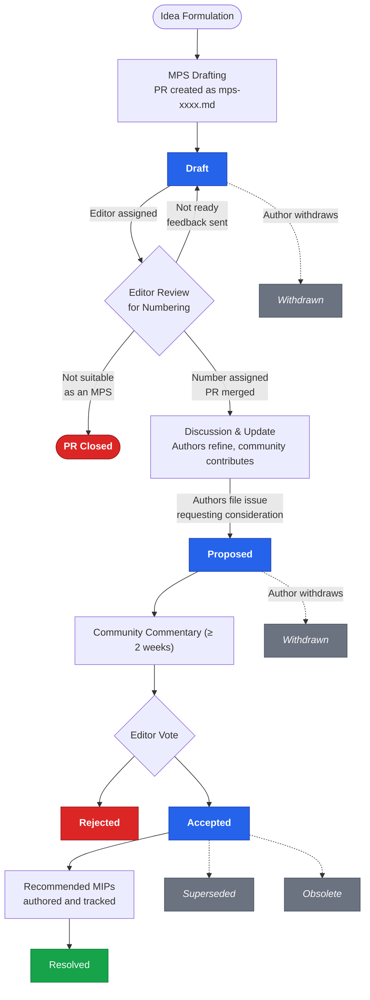

<!--
 Copyright 2026 Midnight Foundation

 Licensed under the Apache License, Version 2.0 (the "License");
 you may not use this file except in compliance with the License.
 You may obtain a copy of the License at

     https://www.apache.org/licenses/LICENSE-2.0

 Unless required by applicable law or agreed to in writing, software
 distributed under the License is distributed on an "AS IS" BASIS,
 WITHOUT WARRANTIES OR CONDITIONS OF ANY KIND, either express or implied.
 See the License for the specific language governing permissions and
 limitations under the License.
-->

## Abstract

A Midnight Problem Statement (MPS) is a formalised document that describes a problem, gap, or opportunity within the Midnight ecosystem in a solution-agnostic manner.
Where a Midnight Improvement Proposal (MIP) describes *how* to change Midnight, an MPS describes *what* needs solving — defining the problem space, the constraints, and the goals that any acceptable solution must satisfy.
In this MPS, we explain what an MPS is, how the MPS process functions, the role of the MPS Editors, and how community members should go about proposing, discussing, and structuring an MPS.

The Midnight Foundation intends MPSs to be the primary mechanism for surfacing problems, capturing community feedback about friction in the ecosystem, and scoping the goals that subsequent MIPs are written to satisfy.
Because MPSs live in the same versioned repository as MIPs, the relationship between problems and the proposals that address them is publicly traceable.

## Motivation

MPSs aim to address two challenges:

- The need to capture and validate problems independently of any particular solution, so that the community converges on *what* matters before debating *how* to solve it.
- The need to give MIP authors a stable, agreed-upon problem definition to work from, reducing the risk of MIPs that solve the wrong problem or talk past one another.

The MPS process does not *by itself* offer any form of governance.
It does not commit the Foundation, Shielded, or any other team to building a particular solution.
It is, however, a crucial input to the governance decision pipeline: a well-formed MPS gives the community shared language for the problem, and gives MIP authors a clear target to design against.

The process detailed herein is intentionally lightweight and is expected to evolve as the Midnight community grows.
This document outlines the technical structure of the MPS and the technical requirements of the submission and review process.

## Specification

### Versioning

MPS-0001 is not versioned and the current version must be followed for all new MPSs.

MPSs themselves are not expected to be versioned in place — when the understanding of a problem shifts substantially, a new MPS should be authored that supersedes the previous one.
Minor clarifications, such as updates to the *Recommended MIPs* section as new MIPs are written, are expected and do not constitute a new version.

### Process Overview

The Midnight Problem Statement (MPS) process consists of the following stages:

1. **Idea formulation:** A problem, gap, or opportunity is identified.
   Small frictions and bug-shaped issues generally do not need an MPS — those can be raised directly in the relevant issue tracker.
   MPSs are appropriate when a problem is broad enough that multiple plausible solutions exist, when the problem will likely require coordination across teams or components, or when capturing community consensus on the problem itself has value.
   As with MIPs, it's a good idea to vet the problem publicly in some way (e.g., in the [Discussions tab](../../discussions) of this repository or on Discord) before writing a formal MPS.

1. **MPS drafting:** A formal MPS document is created.
   This is a document that follows the template structure in `mps-template.md`.
   The authors must create a [midnightntwrk/midnight-improvement-proposals](https://github.com/midnightntwrk/midnight-improvement-proposals) PR where the MPS document is added to the `mps` subdirectory.
   The name of the document must be `mps-xxxx.md` (those are literal `x`'s).
   The status of the MPS must be **Draft** (in the document, that is not necessarily the PR status).
   If the proposal has accompanying resources (such as images), they should be added to a subdirectory of `mps` with the same basename as the MPS filename
   (so for draft MPSs before numbering, this directory is `mps/mps-xxxx`).
   To signal that the MPS is ready for editors to consider numbering it, assign an MPS Editor as a reviewer and mention them in a PR comment.

1. **Editor numbering of the draft:** The MPS Editors consider the draft MPS PR, and assign a number if it's acceptable (as a draft).
   Note that this is **not** the same as acceptance of the MPS itself.
   The MPS Editors will review the draft at one of their next regularly scheduled meetings.
   They will ensure that the document is correctly formatted, that the problem is clearly articulated, and that the document is solution-agnostic (i.e., it describes the problem rather than prescribing a fix).
   The editors will be generally lenient at this stage with the understanding that problems can be refined before the MPS is eventually proposed.
   If the editors deem the MPS is not yet ready for numbering, it will be sent back to the authors with specific feedback.
   The editors may also close the PR if the proposal is fundamentally not suitable as an MPS (e.g., it is a duplicate of an existing MPS, out of scope, or already adequately addressed elsewhere).
   If the editors approve numbering the MPS, they will assign it a number from `NUMBERS_INDEX.md`, update the filename and the number in the document, add the MPS to the index, and merge the PR.

1. **Discussion and update:** The MPS authors finish the draft and address feedback to get it in shape for proposal.
   Discussion should happen in some public forum, such as the GitHub Discussion forum of this repository.
   The relevant issue tracker can be used to raise and track issues with the MPS.
   Contributors can send pull requests to improve the draft MPS.
   This phase is especially important for MPSs, because the framing of the problem materially affects which solutions will be considered downstream.

1. **Proposal:** When ready, the MPS authors formally propose it to the MPS Editors for consideration.
   The MPS authors do this by filing an issue in the MPSs repository, asking for the editors to consider the MPS for acceptance.
   The editors will set the status of the MPS to **Proposed** and mark it as proposed in the index.
   There should be no more substantive modifications to the document
   (small changes like spelling and punctuation fixes are OK; appending to the *Recommended MIPs* section as MIPs are written is also OK).

1. **Review and discussion:** The community and MPS Editors review and discuss the MPS.
   The MPS Editors will announce a period of community commentary, which usually will last at least two weeks.
   They will announce by posting in the proposal issue that they will discuss the MPS at a specific regularly scheduled editors meeting after the commentary period has passed.

1. **Editor decision:** The MPS Editors decide to accept the MPS or not.
   The editors will vote to accept (status **Accepted**) or reject (status **Rejected**) the MPS.
   Acceptance signals that the editors recognise the problem as real, well-scoped, and worth the community's attention — it does not commit any team to a specific solution.
   The editors will update the MPS document and the index to reflect the status.

1. **Recommended MIPs:** Accepted MPSs become inputs to the MIP process.
   The *Recommended MIPs* section of the MPS catalogues the proposals that are expected to address parts of the problem domain.
   As MIPs are drafted, their authors should reference the originating MPS in their *Requires* front matter, and the MPS's *Recommended MIPs* section should be updated to link to them.
   Editors may approve such updates as housekeeping PRs without re-opening the MPS for community review.

1. **Resolution:** An MPS reaches **Resolved** status when the MPS Editors determine that the problem it describes has been adequately addressed.
   This typically means that one or more Recommended MIPs have reached **Active** status (or equivalent terminal status for non-protocol MIPs), and that the goals stated in the MPS have been met.
   Resolution is recorded by the editors via a status update PR.
   An MPS does not need to be Resolved to be useful — long-lived MPSs that track ongoing problem domains are expected.

### Draft Phase Clarifications

The draft phase of the MPS process is designed for open collaboration. The following clarifications address common questions about how drafts move through the system.

**Drafts live in the repository from the start.** An MPS enters the repository as a PR when the author has a draft document (even if incomplete). This ensures that all discussion, revision history, and collaboration happens publicly in the repository from day one. There is no requirement to perfect an MPS outside the repository before creating the PR.

**Numbers are assigned at draft time, not at acceptance.** When an MPS Editor numbers a draft MPS and merges its PR, the number is immediately assigned. This means an MPS has a stable identifier even while still in Draft status. See the [Status Transition Gates](#status-transition-gates) table for the full lifecycle. Numbers may have gaps in the sequence due to rejected or withdrawn proposals — this is expected and unavoidable.

**Formal submission is separate from the initial PR.** Creating the PR to add a draft MPS does not automatically submit it for editor consideration. To formally propose an MPS for acceptance, the authors must file a separate issue in the repository explicitly asking the MPS Editors to review it. The editors will then begin the community commentary period and schedule a vote.

**Community refinement happens in GitHub Discussions.** Once a draft MPS has been merged into the repository, public discussion and refinement should take place in a [GitHub Discussion](https://github.com/midnightntwrk/midnight-improvement-proposals/discussions). When discussion produces meaningful changes that require updates to the MPS document, the GitHub Discussion can be converted to an Issue, and the Issue can inform a follow-up Pull Request.

### MPS Categories

MPSs are categorized to help organize and manage the different types of problem domains:

- **Core:** Problems affecting the core Midnight protocol, consensus mechanisms, virtual machine, or other fundamental aspects of the network.
- **Libraries and Tooling:** Problems with the SDKs, developer libraries, CLIs, and tooling that surrounds the Midnight protocol.
- **Standards:** Problems with conventions, contract interfaces, data formats, or other standardisation gaps within the Midnight ecosystem.
- **Networking:** Problems affecting network communication, peer discovery, and other networking-related aspects.
- **Governance:** Problems with the governance of the Midnight blockchain, including decision-making processes, roles, and responsibilities.
- **Ecosystem:** Problems affecting the broader Midnight ecosystem — adoption, integrations, education, or other concerns that do not fit cleanly into the categories above.

### MPS Statuses

MPSs can have the following statuses mentioned in the Process Overview above:

- **Draft:** The MPS has been submitted as a PR to the MPSs repository and is undergoing writing and revision.
- **Proposed:** A draft MPS has been formally proposed to the MPS Editors for consideration.
  Writing and revision are done.
- **Accepted:** The MPS Editors have voted to accept a proposed MPS.
  The problem is recognised; the *Recommended MIPs* section becomes the tracking surface for ongoing work.
- **Rejected:** The MPS Editors have voted to reject a proposed MPS.
- **Resolved:** The problem described in the MPS has been adequately addressed, typically via one or more Active MIPs.
  This is the final status for an MPS whose problem domain has been closed out.

In addition, there are other statuses that represent events occurring outside the normal process described above:

- **Superseded:** A newer MPS replaces this MPS.
  The newer (accepted) MPS explicitly does this by including as part of its front matter that it supersedes the prior MPS ("Replaces: MPS-1234", for instance).
- **Obsolete:** The MPS is no longer considered relevant — for example, because the underlying conditions that created the problem no longer apply.
  The MPS Editors will occasionally vote to label MPSs this way for clarity.
- **Withdrawn:** The author(s) have withdrawn the MPS.
  This can happen at any time before the MPS Editors vote to accept or reject the MPS.

#### Status Transition Gates

The following table describes the criteria that must be met to transition between statuses:

| From | To | Gate / Criteria |
|---|---|---|
| — | **Draft** | PR submitted to the MPSs repository; editor assigns a number and merges |
| **Draft** | **Proposed** | Authors file an issue requesting editor consideration; document is complete |
| **Proposed** | **Accepted** | Editor vote after community commentary period (≥ 2 weeks) |
| **Proposed** | **Rejected** | Editor vote after community commentary period |
| **Accepted** | **Resolved** | Editors confirm Recommended MIPs have addressed the problem; goals have been met |
| Any (pre-vote) | **Withdrawn** | Author(s) withdraw the MPS |
| Any (post-accept) | **Superseded** | A newer accepted MPS explicitly replaces this one |
| **Accepted** | **Obsolete** | Editors vote to mark the MPS as no longer relevant |

#### Submission

When a draft MPS is "finished" to the authors' satisfaction, it should be proposed by filing an issue in the [Midnight Improvement Proposals](https://github.com/midnightntwrk/midnight-improvement-proposals) repository.
The issue should specify the MPS number and ask the MPS Editors to formally consider it for acceptance.
The MPS Editors will announce the commentary period and when they will vote on the proposal.
After proposing for editor consideration, the MPS should not be substantially altered.

Note: Pull requests should not include implementation code or detailed designs — those belong in MIPs.
An MPS that prescribes a particular implementation is unlikely to be accepted; if the authors have a specific solution in mind, they should accompany the MPS with a corresponding MIP.

Note: Proposals addressing a specific MPS should be listed in that MPS's *Recommended MIPs* section to keep track of ongoing work, and should reference the MPS in their *Requires* front matter.

#### Review and Discussion

Once an MPS is proposed, it enters a period of public review and discussion.
Feedback is encouraged from all Midnight community members.
Discussion should take place on the GitHub issue or by attending an MPS Editors meeting.
Technical experts may be consulted for specific aspects of the problem domain.

#### Recommended MIPs

Once an MPS is accepted, contributors are encouraged to write MIPs that address the goals defined in the MPS.
Each such MIP should reference the originating MPS in its *Requires* front matter, and the MPS's *Recommended MIPs* section should be updated to link to it.
Engineering teams (Shielded Architects & Engineers, community developers) implement the changes specified in those MIPs through the MIP process.

### Artifacts and Tools

- **MPS Document:** The core artifact is the MPS document itself, written in Markdown and stored in the MPSs repository.
- **MPS Template:** A standardized Markdown template for creating MPSs (see [`mps-template.md`](./mps-template.md)).
- **GitHub Repository:** The `mps` subdirectory (in the MIPs repository) on GitHub will be used to:
    - Store all MPS documents.
    - Track the status of each MPS.
    - Facilitate discussion through PRs and issues.
- **Numbers Index:** [`NUMBERS_INDEX.md`](../NUMBERS_INDEX.md) is the canonical index of assigned MPS and MIP numbers.
- **Discussion Forums:** The Midnight Governance Hub (future state) and Discord server should be used for broader discussions and early-stage idea sharing.
- **Meeting Notes:** Notes from any meetings related to MPS discussions should be publicly available in this GitHub repository or linked from it.

### MPS Editors

The MPS process relies on a group of *MPS Editors* to manage the process, ensure quality, and facilitate community discussion.
The MPS Editor role is expected to be served by the same group of community members who serve as MIP Editors, unless and until the volume of MPSs warrants a separate body.

#### Role and Responsibilities

MPS Editors are responsible for:

- Ensuring that MPSs adhere to the MPS template and meet the minimum quality standards (e.g., clarity, scope, solution-agnosticism).
- Assigning MPS numbers from `NUMBERS_INDEX.md`.
- Tracking the progress of MPSs and the MIPs that address them.
- Facilitating community discussion and helping to refine problem framing.
- Voting to accept or reject an MPS.
- Maintaining the MPSs in the repository, including an index of them and their statuses.
- Marking MPSs as Resolved when Recommended MIPs have adequately addressed the problem.

#### Selection and Qualifications

MPS Editors should be selected based on the following criteria:

- **Technical Expertise:** A strong understanding of blockchain technology and the Midnight Network architecture.
- **Community Standing:** Respected and trusted members of the Midnight community.
- **Impartiality:** Ability to evaluate MPSs objectively and fairly.
- **Communication Skills:** Excellent written and verbal communication skills.
- **Availability:** Willingness to dedicate sufficient time to review and process MPSs.

#### Nomination and Rotation of Editors

The initial set of MPS Editors will be appointed by the Midnight Foundation and Shielded, and is expected to overlap substantially with the MIP Editors.
Subsequently the below set of rules will apply to the addition and removal of MPS Editors.

To become an MPS Editor one must be:
- Nominated by anyone.
- All sitting MPS Editors must agree to their becoming an MPS Editor by public vote at an MPS Editors' meeting either by expressing support in person or in a written submission to the meeting.

The Midnight Foundation will revoke the administrator rights of an MPS Editor over the MPS repository (and they will cease to be an MPS Editor) if one of the following happens:
- The MPS Editor themselves asks to resign.
- The MPS Editor fails to attend X MPS Editor meetings in a row and a petition is sent to the Midnight Foundation.
- All other MPS Editors vote to remove that specific Editor.

## Path to Resolved

Every MPS should describe what would constitute a resolution to its problem.
This belongs in the MPS's *Goals* and *Expected Outcomes* sections (see template), and is the criteria against which the editors will later assess whether to mark the MPS as **Resolved**.

### Resolution Criteria

Define objective criteria such as:
- One or more Recommended MIPs have reached Active (or otherwise terminal) status.
- The friction or gap identified in the *Problem* section is no longer observed in the ecosystem.
- Adoption metrics or community sentiment indicate that the problem has been addressed.

### Tracking Plan

Describe how progress toward resolution will be tracked.
This may include:
- Pointers to the MIPs that address the problem.
- Milestones for the implementation work happening in those MIPs.
- Touchpoints (e.g., quarterly reviews) at which the editors will reassess the MPS's status.

### MPS Template

All MPS documents *must* follow the Markdown template defined in [`mps-template.md`](./mps-template.md) and use YAML front matter:

MPS: \<Number\> # assigned by editors
Title: \<Problem Statement Title\>
Authors: \<Name\> \<github-username\>
Status: \<Status\> # All new MPSs will be assigned Draft
Category: \<Core | Libraries and Tooling | Standards | Networking | Governance | Ecosystem\>
Created: DD-MMM-YYYY
Requires: [List of other MPS or MIP this MPS depends on, or "none"]
Replaces: [List of MPS that this one replaces, or "none"]

The body of an MPS should contain the following sections (see `mps-template.md` for the full guidance):

- **Abstract** — ~200 word summary of the problem, solution-agnostic.
- **Vision** — the ideal future state once the problem is addressed.
- **Problem** — detailed description of current challenges, friction, and gaps.
- **Use Cases** — concrete scenarios that illustrate the problem.
- **Goals** — high-level, outcome-oriented objectives that solutions should achieve.
- **Expected Outcomes** — benefits the ecosystem will realise when the problem is addressed.
- **Open Questions** — unresolved questions that require further discussion.
- **Recommended MIPs** — MIPs (existing or proposed) that address the problem domain.
- **References** (optional) — external sources and prior discussions.
- **Acknowledgements** — contributors beyond the named authors.
- **Copyright** — license notice.

## Backwards Compatibility Assessment

This MPS introduces a process that runs alongside the existing MIP process; it does not modify MIP-0001.
Existing MPS documents in the `mps/` directory predate this process document and use a mix of statuses (predominantly **Proposed** and **Accepted**).
Those MPSs should be treated as grandfathered: their current statuses remain valid, and editors may update them to align with the statuses defined here as a housekeeping pass.

## Security Considerations

The MPS process is a documentation and governance process and does not directly introduce protocol or implementation-level security considerations.
Editors should, however, be alert to MPSs that frame problems in a way that constrains solutions toward insecure designs, and should push back during the discussion phase if a problem framing appears to preclude reasonable security mitigations.

## References

- [MIP-0001: Midnight Improvement Proposal Process](../mips/mip-0001-mip-process.md) — the sibling process document for MIPs, which this MPS mirrors.
- [`mps-template.md`](./mps-template.md) — the canonical template for new MPSs.
- [`NUMBERS_INDEX.md`](../NUMBERS_INDEX.md) — the canonical index of assigned MPS and MIP numbers.

## Acknowledgements

This process document draws directly on the structure and language of MIP-0001, authored by Bob Blessing-Hartley and Kevin Millikin, and is intended to remain consistent with it.

## Copyright

This MPS is licensed under CC-BY-4.0.
