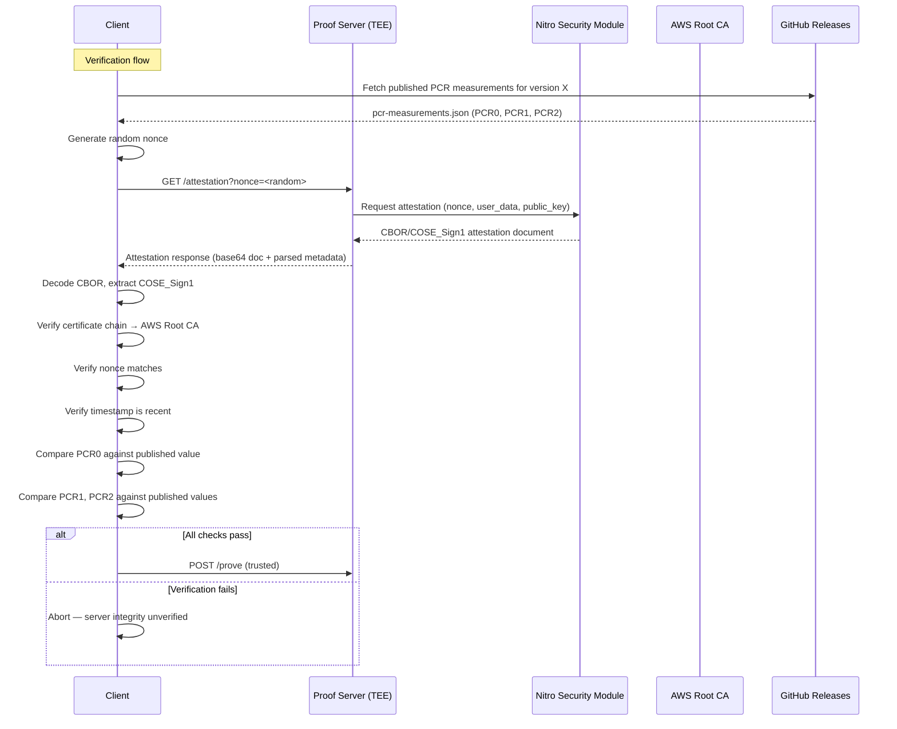

## Abstract

Every Midnight transaction involving private state or shielded tokens requires a zero-knowledge proof. Generating these proofs is computationally expensive — requiring hundreds of milliseconds to seconds of CPU time, ~50 MB of RAM per proof, and access to large proving key files. This makes proof generation impractical on constrained devices (mobile phones, browser environments) and creates a tension: users must either run heavyweight cryptographic operations locally or delegate proof generation to a third party who then sees their private witness data. This problem statement explores how delegated proof generation can be made trustworthy through hardware-enforced isolation, so that a proof server never gains the ability to extract, modify, or exfiltrate the private data it processes — even if the server operator is compromised.

## Problem

### Current State

Midnight's privacy model depends on Plonk zero-knowledge proofs for ZSwap (shielded token) operations and Compact smart contract execution. The proving pipeline involves:

1. The client constructs a **proof preimage** containing private witness data (spending secrets, amounts, nullifier preimages) and public inputs.
2. A **proving engine** takes this preimage, loads the appropriate circuit's proving key, and produces a ZK proof.
3. The proof is attached to the transaction and submitted to the network for on-chain verification.

The proving engine currently ships as part of the midnight-ledger Rust crate workspace. Wallet SDKs wrap this via WASM or native bindings for client-side proof generation.

### Limitations

**Computational Cost**: A single ZSwap spend proof requires ~190ms on a 32-core server but can take 5-30 seconds on a consumer laptop and is infeasible in WASM on mobile browsers. Wallets targeting broad device support cannot rely on client-side proving.

**Resource Requirements**: Proving keys for the four built-in circuits (zswap/spend, zswap/output, zswap/sign, dust/spend) total hundreds of megabytes. Downloading and caching these on mobile devices is impractical.

**The Delegation Dilemma**: If a client delegates proof generation to a remote server, the server receives the private witness — which includes spending secrets, amounts, and nullifier preimages. A compromised or malicious server could:
- Extract spending keys and steal funds.
- Record witness data for future deanonymization.
- Modify the proof preimage to redirect transaction outputs.
- Selectively deny service to targeted addresses.

**No Verifiable Execution Environment**: Standard cloud VMs provide no cryptographic assurance about what code is running. A server operator could deploy a modified binary that logs witness data while still producing valid proofs. Clients have no way to distinguish a legitimate server from a malicious one.

**Reproducibility and Auditability**: Even if a server claims to run inside a TEE, clients need a way to verify: (a) that the server is actually in a TEE, (b) that the code running matches a known-good build, and (c) that the attestation itself hasn't been replayed or forged.

### Why Existing Approaches Fail

**Client-Side Only**: Forces all users to have hardware capable of proof generation. Excludes mobile, web, and low-power devices from participating in shielded transactions.

**Trusted Third-Party Server (No TEE)**: Requires users to trust the server operator's honesty. No cryptographic guarantee exists that the operator isn't logging data. This is the model used by most existing blockchain proof services and it fundamentally contradicts Midnight's privacy guarantees.

**Centralized Proof Service**: A single operator running the proof service creates a central point of failure and trust. If the operator is subpoenaed, coerced, or compromised, all users' privacy is retroactively broken for transactions processed by that server.

**MPC-Based Proving**: Multi-party computation could split the witness across multiple provers so no single party sees the full data. However, MPC protocols for Plonk proving are not mature, add orders-of-magnitude latency, and require coordination between independent parties — making them impractical for real-time transaction processing.

## Use Cases

### UC1: Mobile Wallet Shielded Transfer

**Scenario**: A user on a smartphone wants to send a shielded token transfer to another user. Their phone has 4 GB RAM and a mid-range ARM processor.

**Current Approach**: The wallet SDK attempts client-side proof generation via WASM. Proving keys must be downloaded (hundreds of MB), cached, and the proof computation runs for 15-30 seconds — during which the UI freezes and battery drain is significant.

**Limitations**: Users on older devices experience timeouts or OOM crashes. The UX is unacceptable for a payment system that aims to compete with conventional fintech.

**Desired Outcome**: The wallet delegates proof generation to a remote server. The proof is returned in under 1 second. The user's private witness data is never accessible to the server operator, the cloud provider, or any third party — enforced by hardware, not policy.

### UC2: DApp Contract Interaction at Scale

**Scenario**: A DApp backend processes 100+ Compact contract interactions per minute, each requiring proof generation. The DApp operator runs their own infrastructure.

**Current Approach**: The DApp backend either bundles the midnight proving library directly (consuming significant CPU/RAM per instance) or calls an external proof service with no integrity guarantees.

**Limitations**: Self-hosted proving requires expensive compute instances (32+ cores, 64 GB RAM). External proof services see the DApp's private contract inputs, which may contain business-sensitive data (pricing, inventory, user identifiers).

**Desired Outcome**: The DApp operator runs a proof server on their own cloud infrastructure, inside a TEE. They can prove to their users (and regulators, if needed) that the server never had access to unencrypted witness data — backed by a cryptographic attestation document verifiable by any third party.

### UC3: Network-Wide Proof Service with Verifiable Integrity

**Scenario**: An ecosystem/community member operates a proof server for Midnight community  users. Community members and auditors want to verify that the Foundation's server is running authentic, unmodified code.

**Current Approach**: The proof server operator publishes the server's source code and claims it runs unmodified. Users must trust this claim.

**Limitations**: Source code publication proves nothing about what binary is actually running in production. A modified binary could be deployed that exfiltrates data while remaining source-compatible.

**Desired Outcome**: The server produces a cryptographic attestation document on demand. Any client can verify: (1) the server runs inside a genuine TEE, (2) the binary matches a published, reproducible build (identified by PCR0/hash), and (3) the attestation is fresh (not replayed). Verification requires only the attestation document, the TEE vendor's root certificate, and the published build measurements — no trust in the server operator.

### UC4: Multi-Cloud Operator Deployment

**Scenario**: An enterprise operating Midnight infrastructure uses a multi-cloud strategy (AWS primary, GCP failover). They need proof generation in multip;e environments with equivalent security guarantees.

**Current Approach**: No existing solution supports TEE attestation across cloud providers with a single binary.

**Limitations**: Each cloud provider's TEE technology differs fundamentally — AWS Nitro Enclaves (NSM device, CBOR attestation), GCP Confidential VMs (TPM 2.0, PCR quotes), Azure Confidential VMs (IMDS JWT tokens). Building and maintaining separate server implementations per cloud is prohibitively expensive.

**Desired Outcome**: A single proof server binary detects its TEE platform at runtime and produces platform-appropriate attestation documents. Clients verify attestation using a unified verification flow, regardless of which cloud the server runs on.

## Goals

### Primary Goals

1. **Hardware-enforced witness confidentiality**: Private witness data processed during proof generation must never be accessible outside the TEE's encrypted memory — not to the server operator, the cloud provider, or the host operating system. This is the foundational security property.

2. **Cryptographic attestation of server integrity**: Clients must be able to verify, using only publicly available information (attestation document, vendor root certificate, published build measurements), that the proof server is running authentic, unmodified code inside a genuine TEE. Verification must be automatable (no manual inspection).

3. **Production-grade performance**: Delegated proof generation must be faster than client-side proving on mainstream devices. Target: median proof latency under 250ms on recommended server hardware, with throughput scaling linearly with worker count.

4. **Multi-cloud TEE support**: The same server binary must operate in AWS Nitro Enclaves, GCP Confidential VMs, and Azure Confidential VMs, with platform detection and attestation handled transparently.

5. **Reproducible builds for PCR verification**: The build process must be deterministic so that anyone can rebuild the binary, compute the expected PCR0 (code measurement), and compare it against the published value. This closes the gap between "open source" and "verifiably running this open source."

### Requirements

- **Performance**: Proof generation throughput ≥ 80 proofs/sec at 16 workers on 32-core hardware. p50 latency < 250ms, p99 < 600ms for standard ZSwap proofs. Cold start to ready (including parameter pre-fetch) < 60 seconds.
- **Security**: API keys hashed (never stored plaintext). TLS by default for all communications. No persistent storage inside the TEE. Per-IP rate limiting to prevent abuse. Graceful authentication with zero-downtime key rotation.
- **Privacy**: Witness data and proving keys exist only in TEE-encrypted memory during proof generation. No logging of witness content. Memory is released after each proof. No persistent storage that could be forensically recovered.
- **Compatibility**: Proof output must be identical to client-side generation — the on-chain verifier cannot distinguish server-generated from client-generated proofs. Binary serialization format must match the midnight SDK's tagged serialization.
- **Usability**: Operators must be able to deploy with a single binary and minimal configuration (port + API key). Health/readiness probes must be compatible with standard orchestrators (Kubernetes, systemd). All configuration via CLI flags or environment variables.

### Success Metrics

- **Attestation verification rate**: 100% of attestation documents produced in a real TEE pass independent third-party verification using only the published PCR values and vendor root certificate.
- **Proof correctness rate**: 100% of proofs generated by the server pass on-chain verification (same rate as client-side generation).
- **Proof generation reliability**: ≥ 99.9% of well-formed proof requests produce a valid proof within the configured timeout.
- **Operational stability**: Continuous operation for 30+ days under production load without memory leaks, crashes, or throughput degradation.
- **Adoption feasibility**: Deployable on any of the three major cloud TEE platforms without source code changes or conditional compilation.

### Non-Goals

- **Proof verification**: The proof server generates proofs; verification is the on-chain runtime's responsibility. Adding a verification endpoint would increase attack surface without adding value (clients can verify locally if needed).
- **Key generation / trusted setup**: Proving and verification key generation is handled by the midnight-trusted-setup process. The proof server consumes pre-generated keys.
- **Client SDK development**: Libraries for serializing proof requests and deserializing responses belong in the midnight-js and midnight-wallet repositories, not in the proof server.
- **Multi-tenancy and billing**: Per-tenant isolation, usage metering, and billing are infrastructure-level concerns outside the scope of the proof server application.
- **Load balancing and auto-scaling**: The proof server is a single-instance application. Horizontal scaling is handled by infrastructure tooling (load balancers, container orchestrators).
- **MPC-based distributed proving**: While theoretically interesting, MPC protocols for Plonk are too immature and too slow for real-time transaction processing. This may become relevant in a future MPS.
- **GPU-accelerated proving**: The Midnight Plonk implementation is CPU-based (field arithmetic, FFTs, polynomial evaluation). GPU acceleration would require rewriting the proving engine, which is a separate problem.

## Open Questions

1. **Attestation freshness and replay prevention**: How should clients determine that an attestation document is "fresh enough"? A strict timestamp check (e.g., < 5 minutes old) requires clock synchronization. A nonce-based approach requires a round-trip per verification. What is the right trade-off between freshness guarantees and verification overhead for different client types (wallets vs. auditors)?

2. **PCR publication trust model**: Published PCR measurements must be trusted as the canonical reference. If they are published to GitHub Releases and a CDN, what prevents a compromised GitHub account from publishing false PCRs? Should PCR measurements be signed by a separate offline key? Should multiple independent parties attest to the same build?

3. **Cross-platform attestation equivalence**: AWS Nitro, GCP, and Azure TEEs provide different security guarantees (Nitro's full VM isolation vs. GCP's process-level confidential computing). Should the attestation response communicate a "confidence level" so clients can decide whether a particular platform meets their security requirements? Or is binary (TEE/not-TEE) sufficient?

4. **TEE side-channel resistance**: TEEs protect against software-level attacks but are not immune to hardware side-channels (cache timing, power analysis). Should the proof server implement additional mitigations (constant-time operations, memory access pattern obfuscation) for the proving hot path? What is the performance cost, and does the threat model justify it?

5. **Graceful degradation when TEE is unavailable**: The server currently runs in "development mode" without attestation when no TEE is detected. Should production deployments enforce TEE presence (refuse to start outside a TEE)? Or should clients make the trust decision based on the attestation response? What are the operational implications of hard-requiring TEE for disaster recovery scenarios?

6. **Cost model for delegated proving**: Proof generation consumes significant compute resources. How should the cost be distributed? Should proof servers charge per-proof fees (requiring on-chain micropayments)? Should proof generation be subsidized by the network (funded from block rewards)? Or is the current model (operator pays infrastructure costs, recoups through their business model) sufficient?

7. **Proving key distribution and integrity**: Proving keys are currently fetched from a CDN via MidnightDataProvider. Inside a TEE, network access may be restricted (e.g., Nitro Enclaves have no direct network access). How should proving keys be provisioned to the enclave? Pre-baked into the enclave image (increases image size but simplifies runtime)? Passed through vsock from the host (introduces a trust boundary)?

## References

- AWS Nitro Enclaves documentation: https://docs.aws.amazon.com/enclaves/latest/user/
- GCP Confidential Computing: https://cloud.google.com/confidential-computing
- Azure Confidential VMs: https://learn.microsoft.com/en-us/azure/confidential-computing/
- Midnight Privacy Ledger specification: `midnight-ledger/spec/`
- ZSwap protocol implementation: `midnight-ledger/zswap/`
- Plonk proof system: Gabizon, Williamson, Ciobotaru — "PLONK: Permutations over Lagrange-bases for Oecumenical Noninteractive arguments of Knowledge" (2019)
- COSE_Sign1 (RFC 9052): https://www.rfc-editor.org/rfc/rfc9052 — Attestation document format for AWS Nitro
- TPM 2.0 Specification: https://trustedcomputinggroup.org/resource/tpm-library-specification/

## Appendices

### Appendix A: Proof Generation Performance Characteristics

Performance data from the existing proof server prototype (v8.0.3) on 32-core AMD EPYC, 64 GB RAM:

| Workers | Throughput (proofs/sec) | Latency p50 | Latency p99 | Peak Memory |
|---------|------------------------|-------------|-------------|-------------|
| 8       | 45                     | 180ms       | 450ms       | ~500 MB     |
| 16      | 87                     | 190ms       | 480ms       | ~900 MB     |
| 32      | 156                    | 210ms       | 520ms       | ~1.8 GB     |

Base memory: ~100 MB. Per-proof memory: ~50 MB.

These numbers demonstrate that delegated proving on server hardware is 25-150x faster than client-side proving on consumer devices, validating the motivation for a dedicated proof server.

### Appendix B: TEE Attestation Flow

### Appendix C: Existing Prototype

An implementation prototype exists at `midnight-ledger/tee-proof-server-proto/proof-server/` (v8.0.3). It implements the core proving pipeline, multi-platform TEE attestation, TLS, API key authentication, rate limiting, and a worker pool architecture. The prototype serves as a reference for evaluating proposed solutions against this problem statement.

Key implementation characteristics:
- Rust, Axum 0.8, Tokio async runtime
- Binary serialization (midnight tagged format, not JSON)
- AWS Nitro NSM API integration for attestation
- GCP TPM 2.0 and Azure IMDS support (basic)
- 6 source files, ~1200 lines of Rust
- Compatible with midnight-ledger v8.0.3

## Copyright

This MPS is licensed under CC-BY-4.0.
